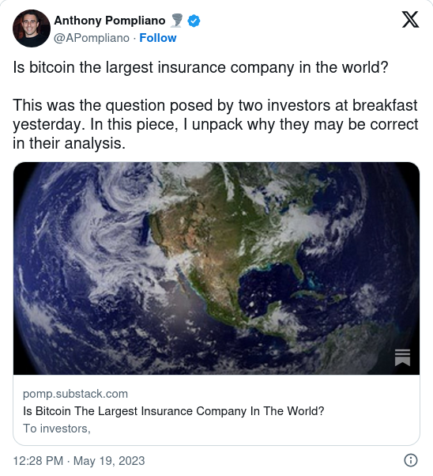
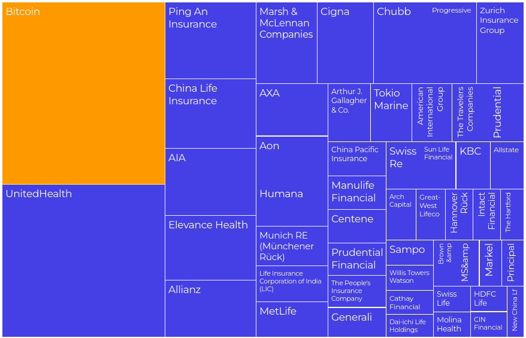

In a recent [article](https://pomp.substack.com/p/is-bitcoin-the-largest-insurance#details) and also on a Twitter thread, American entrepreneur, investor, and influencer Anthony Pompliano has called Bitcoin ‘the largest insurance company in the world’:

His argument in the article is quite straight-forward:

- Bitcoin can protect its buyers from currency debasement, sovereign default or undisciplined monetary and fiscal policy. In order to receive this risk protection, someone has to pay the current Bitcoin price, which could be considered a one-time insurance premium. The earlier they buy this insurance, the cheaper it is.
- Instead of relying on an insurance company to honor their policy during a crisis, Bitcoin offers a digitized solution that doesn’t require you to file a claim, eliminating the need for trust.
- Pompliano even goes further in his article. According to him, Bitcoin offers insurance for previously uninsurable risks, like high inflation or government seizure of assets.
- In summary, Bitcoin as a $500+ billion insurance product could be considered the largest insurance in the world.

Bitcoin as an insurance? Even the largest insurance in the world? It is an intriguing thought, which many in the Bitcoin community seem to share. Let’s take a closer look at this.

## Bitcoin Is a Hedge, Not an Insurance

In our opinion, calling Bitcoin an insurance, never mind an insurance _company_, is flawed.

First and foremost: Bitcoin is _not_ a company. Of course, this is absolutely clear to anyone in the Bitcoin community, but we should be careful not to use these kinds of words mindlessly in the context of Bitcoin, especially because most other cryptosecurities are, in fact, companies. But let’s not focus on this aspect too much. Is Bitcoin an insurance then?

In our view, Bitcoin is not an insurance, but rather a hedge. Let me explain.

Both insurance and hedges serve as a method for risk management, aiming to mitigate potential financial losses. However, there are some key differences between these two tools:

1. **Predetermined Compensation:** In insurance, there is typically a contract that specifies the coverage and the amount of compensation to be provided in the event of a covered incident. This predetermined compensation provides foreseeable financial certainty to the buyer of the insurance policy. On the other hand, a hedge does not guarantee a specific compensation amount, but rather aims to minimize potential losses or offset risks by using financial instruments or strategies.
2. **Specific Event Coverage:** Insurance is designed to cover specific events or risks, such as accidents, theft, or property damage. The compensation is triggered by the occurrence of these predetermined events. In contrast, a hedge is more general and focuses on reducing potential losses or managing risks across various aspects of an investment portfolio or financial position.
3. **Contractual Obligations:** Insurance involves a contractual agreement between an insurer and a policyholder. The insurer agrees to provide coverage and compensation in exchange for premium payment. Hedging, on the other hand, does not necessarily involve contractual obligations between two parties. It often involves taking positions in financial instruments or strategies to offset risks.
4. **Timeframe**: Insurance policies typically have defined terms and coverage periods. The compensation is provided during the term of the policy if the specific event occurs. Hedging, however, can be an ongoing strategy employed to manage risks and protect against potential losses over an extended period.

Looking at all these points, Bitcoin obviously shares more characteristics with a hedge rather than an insurance: there is no predetermined compensation, there is no specific event coverage, there is no contract between a risk carrier and an insuree, and there is no defined terms and coverage period.

However, we might say that the general population uses terms like ‘insurance’ or ‘hedge’ interchangeably, and most people would probably not care too much about this level of detail. Let’s therefore suppose Bitcoin could be considered an insurance – how would its size compare to the insurance industry?

## Bitcoin Would Be a Massive Insurer

The following chart shows the market capitalization of Bitcoin at the time of writing this article in comparison to the world’s 50 largest insurance companies:

Source: [Coinmarketcap.com](https://coinmarketcap.com/de/currencies/bitcoin/) and [Companiesmarketcap.com](https://companiesmarketcap.com/insurance/largest-insurance-companies-by-market-cap/)

As can be seen from this chart, by terms of the market capitalization, Bitcoin is larger than any insurance company in the world! At its current all-time-high of $65,000 in 2021, Bitcoin had a market capitalization of over $1,250bn, which had been bigger than the market cap of the 30 largest insurance companies in the world, employing millions of people!

Let’s now take a look at how this relates to the whole global insurance market:

Source: [Researchandmarkets.com](https://www.researchandmarkets.com/reports/5596091/insurance-providers-brokers-and-re-insurers?utm_code=kcflxq&utm_exec=chdo54prd)

The insurance industry is vast and encompasses numerous companies providing a wide range of coverage. To me, it is absolutely mind-boggling to see that Bitcoin already represents roughly 1/11 of the worldwide insurance market, at the time of writing this article!

As I’ve discussed above, insurance and hedges are two tools for risk management. In this regard, we consider Bitcoin a hedge. However, it is important to keep in mind that Bitcoin’s role and potential extends far beyond mere risk management, and it offers several unique characteristics that set it apart from traditional insurance, hedges, or any other existing financial instruments.

For a growing number of people, Bitcoin is a long-awaited alternative to the fiat money standard we are currently living under. An alternative to inflationary money defined by unelected central and private bankers. An alternative to the centralized control of monetary policy. An alternative to the incentivizing of speculation and corruption. And an alternative to financial exclusion and political manipulation. As Michael Saylor, the founder and chairman of the software company MicroStrategy [put it](https://twitter.com/saylor/status/1440014692001402881):

> _“Bitcoin is a bank in cyberspace, run by incorruptible software, offering a global, affordable, simple, and secure savings account to billions of people that don’t have the option or desire to run their own hedge fund.”_

## Summary

Whether Bitcoin is an insurance or not, remains to be decided by the reader. To me, it would be an imprecise and flawed description of Bitcoin. In terms of risk management, Bitcoin shares more characteristics with a hedge. However, reducing Bitcoin to a mere risk management tool does not do justice to the full potential that lies in Bitcoin. It presents a groundbreaking alternative to the prevailing fiat money system, with unique characteristics that distinguish it from traditional financial instruments or assets. It offers an escape from inflationary money, centralized control of monetary policy, speculation-induced corruption, financial exclusion, and political manipulation.