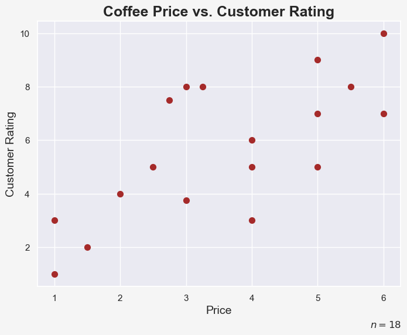
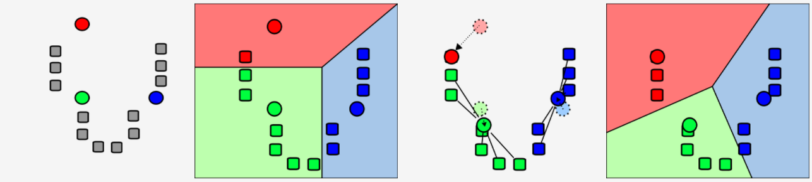
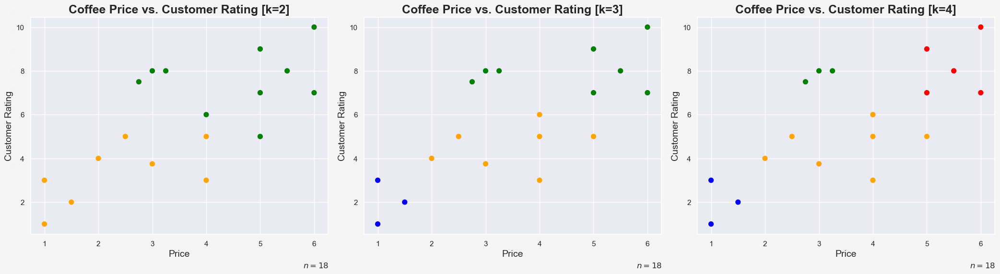
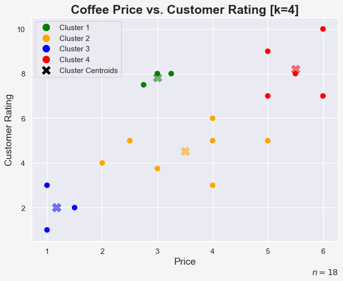
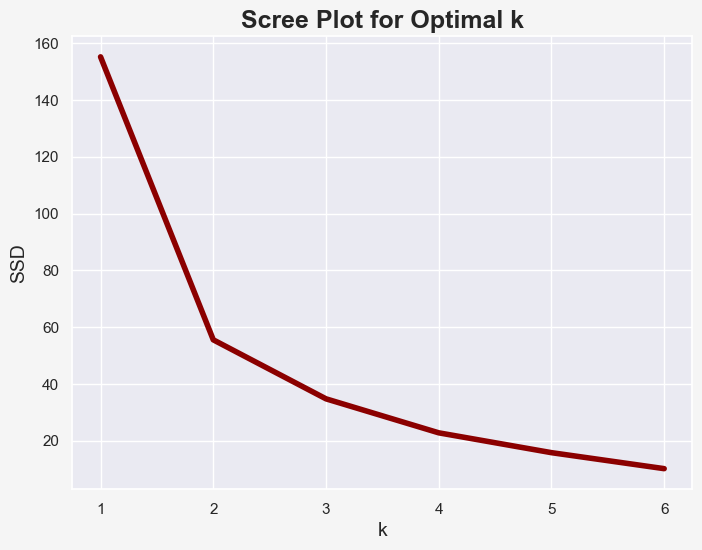
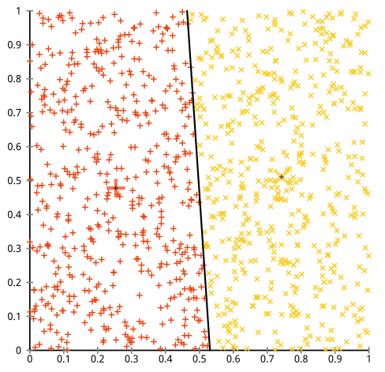
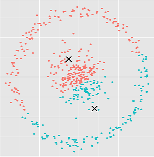

The k-means algorithm is used to divide unlabeled data into categories or classes, in order to draw useful conclusions from the resulting clusters.

Let's take a look at an imaginary dataset of n = 18 observations of different coffee brands. Note that we would never actually use the k-means algorithm on such a small data set.

We plot the price of the coffee vs. the rating obtained by customers:

As coffee drinkers, we might be interested in finding certain clusters in this data, so that we might purchase the best coffee we can afford with a given budget.

Obviously, with only 2 features (price and customer rating), it is very easy for us to spot different clusters with a simple scatter plot. But imagine if we had 10 features of 10,000 observations. Clearly, finding reasonable clusters would be a very difficult task. Luckily, there is the k-means algorithm!

## How Does the k-Means Algorithm Work?

The k-means algorithm essentially follows these steps:

1. Determine k, which is the number of clusters you want to find in your data
2. Randomly set k points within our dataset as the means (or centroids) of the k clusters
3. Assign each data point to the closest cluster mean, usually by using the Euclidean distance
4. Recalculate the cluster means with the newly assigned data points
5. Repeat step 3 and 4 until there is no change in clusters anymore

Note that, if your input features have a different order of magnitude, you should always scale it before feeding it into the k-means algorithm.
 
And here is a simplified visualization of this process:

Looking at these 5 steps, you might wonder what value we should set the parameter k to be in the very beginning? Good question!

Sometimes, the answer to this question lies within the initial question you want to answer by using k-means. For example, imagine you want to cluster a dataset containing image information of banknotes into real and forged ones. Here, you would have a binary classification problem, and you would set k = 2.

In many cases, you do not know what the best value for k would be beforehand. In this case, you can use the variability within the clusters for different values of k, in order to determine the best value for it. This can be done using the Sum of Squared Distances (SSD) between each data point to its cluster centroid, which can be shown for different k's in a scree plot, also known as elbow-plot. We will look at an example for this later.

## k-Means in Action

Let's see how the k-means algorithm clusters our coffee price vs. customer rating dataset. I used Python and sklearn to perform this task for k = 2, k = 3 and k = 4:

You can see the different ways the algorithm finds clusters for the different values of k. For example, in the k = 4 plot we might describe the clusters like this:

- cheap and disgusting coffee (blue)
- average coffee (yellow)
- cheap and tasty coffee (green)
- expensive and tasty coffee (red)

Let's add the centroids to the k = 4 scatter plot to better see the results:

Next, I plotted a scree plot for different values of k:

Imagine the scree plot being an arm. The elbow method then suggests selecting k as the corresponding value at the elbow of the arm. If we increase k beyond the elbow, the SSD only decreases slightly. However, if we look at our coffee example, we might find reasons to use k values of 2, 3 or even 4. There is not always a right or wrong answer to the question of the best value for k!

## Limitations and Problems of k-Means

The k-means algorithm is very easy to understand and can be applied in many situations. However, it has certain limitations and problems. Below are just a few, check out this post for more details on these drawbacks.

- Each data point can only belong to one cluster. This raises the question of how the algorithm should deal with data points that lie exactly between two cluster means.
- The first initialization of the centroids is random. Running the k-means on the exact same dataset can therefore result in different clusters.
- k-means will find (meaningless) clusters in a uniform dataset:

- In k-means, one cluster can never contain another cluster. In order to  understand this problem, let's take a look at the following image and  think what might be a better way to cluster the data points:

  

## Summary

As we have seen, k-means is a very straight-forward algorithm to find clusters within unlabelled data. The essence of k-means is to find k clusters and their respective centroids and assign each data point to the cluster with the shortest distance between the data point and the clusters' centroid.
 
However, k-means has its limitations. Therefore, one might suggest using k-means during the exploratory data analysis to get a basic understanding of the structure of the data and then proceed with more sophisticated algorithms.

## Sources and Further Materials

- Ng, Annalyn & Soo, Kenneth - Numsense! Data Science for the Layman (2017)
- https://en.wikipedia.org/wiki/K-means_clustering 
- https://stats.stackexchange.com/questions/133656/how-to-understand-the-drawbacks-of-k-means 
- https://www.youtube.com/watch?v=4b5d3muPQmA 