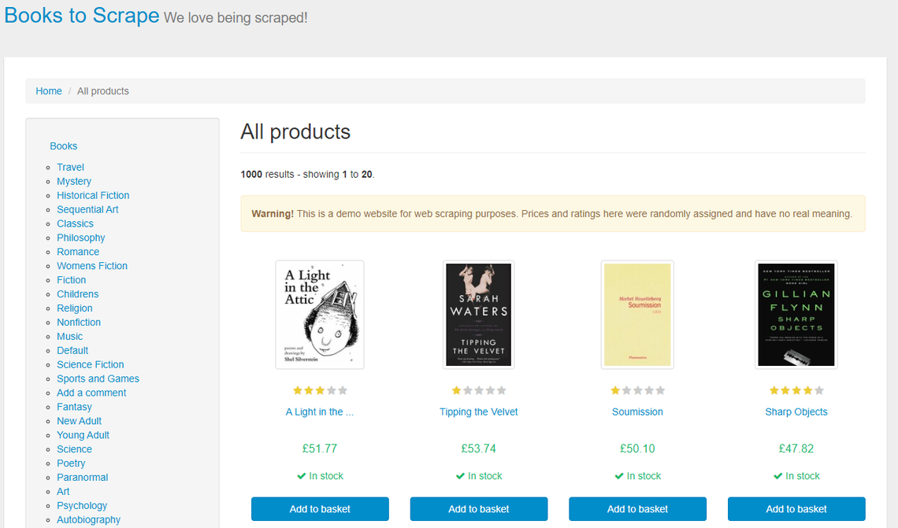
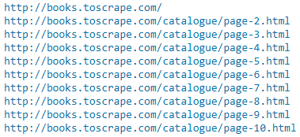
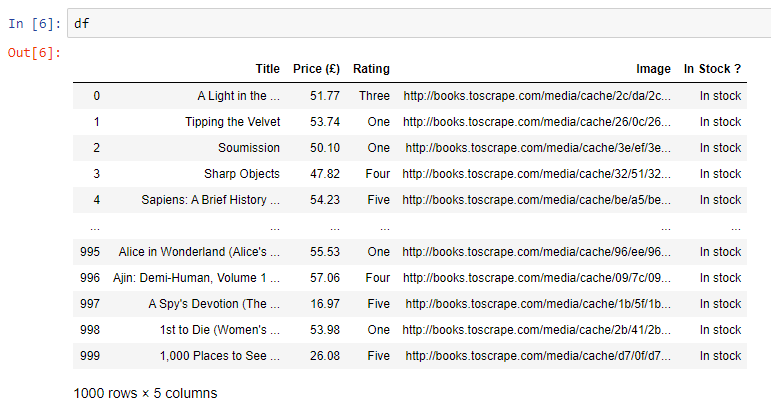
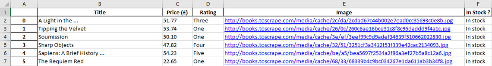

Web Scraping is the automated process of extracting data from websites. This is commonly done by retrieving the HTML code of a website through a request and then extracting the information hidden in the HTML code programmatically. This is especially convenient when there is no API available to you!

There has been a lot of discussion going on about the legality and ethics of Web Scraping, which I do not want to get into in this article. You can check out this Wikipedia article and this blog post, if you want to know more about that.

Some websites simply do not want you to scrape them. A good practice is to consult the "robots.txt" file before you scrape a website. This is basically a guideline by the website, which states what automated actions they allow or disallow. You can see this file by adding "/robots.txt" to any website (e.g. [https://www.ikea.com/robots.txt](https://www.ikea.com/robots.txt)).

No matter what, if you are going to scrape a website, you should always be polite! That means you should space out your requests, in order not to overload the servers of the website you want to scrape. If you are too aggressive, your IP address might get blocked.

## Let's Scrape a Book Shop

Next, let me show you a very simple example of how you might extract data from a book shop. For this, I want to take you through my code for scraping a fictional online book shop, which you can find at http://books.toscrape.com/

The website looks like this:



There are 1,000 books on this website, and we want to get data for all of them!

## Importing the Required Packages

As always, we need some packages to perform the task at hand.
We will use pandas to assemble the extracted data in a data frame, which we will output as a CSV or Excel file at the end.
We use the requests module to get the HTML code from the website
The time package is needed to add a short break in between each request
BeautifulSoup is needed to perform the actual scraping
Finally, we need the urljoin function from the urllib.parse package in order to correctly scrape the url of the images.

```python
import pandas as pd
import requests
import time
from bs4 import BeautifulSoup
from urllib.parse import urljoin
```

## Defining the Classes and Methods

First, we define a class called CrawledBooks, which is used to model a book. We are interested in the books title, price, rating, image and whether it is currently in stock or not. Therefore, we assign these properties to the CrawledBooks class.

Next, we define the crawler class called BookCrawler which has a fetch method that will perform the web scraping. The fetch method works as follows:

- We first initialize the url variable and get the HTML code using the requests package and transform it to a BeautifulSoup object
- We also initialize an empty list for the books
- Then, we have the main loop. doc.select('.next') will be a True boolean value as long as there is a "Next" button on the webpage that is currently scraped. As soon as we have reached the last page, the while loop will stop
- We add 1 second between each request and print the URL that is currently scraped, just in order to see what is going on
- Then, we need to redo our request each time we go through the while loop, because the URL will be different according to the current page we are on
- Next, we enter into a for loop, which extracts all the data we want from the HTML code and assigns it to the variables title, price, rating, image and available. These variables are then used to create an instance of the CrawledBooks class called crawled_books. This last variable crawled_books is then appended to the books list.
- The following try/except statement is used to update the URL by concatenating the base of the URL (http://books.toscrape.com/) with the respective ending of the page that is to be scraped next (for example /catalogue/page-2.html)
- We end the fetch method by returning the books list

```python
class CrawledBooks():

    def __init__(self, title, price, rating, image, available):
        self.title = title
        self. price = price
        self.rating = rating
        self.image = image
        self.available = available
        
class BookCrawler():
    def fetch(self):
        
        url = 'http://books.toscrape.com/'
        r = requests.get(url)
        doc = BeautifulSoup(r.text, "html.parser")
        books = []
        
        # The following while-loop is executed until the last page has been reached
          
        while doc.select('.next'):
          
        # We set a break of 1 second in between each request and the URL that is currently 
        time.sleep(1)print(url)
            
        r = requests.get(url)
        doc = BeautifulSoup(r.text, "html.parser")
            
        for element in doc.select('.product_pod'):
                
            title = element.select_one('h3').text
            price = element.select_one('.price_color').text[2:]                    
            rating = element.select_one('p').attrs['class'][1]
            image = urljoin(url, element.select_one('.thumbnail').attrs['src'])
            available = element.select_one('.instock').text[15:23]                         
            crawled_books = CrawledBooks(title, price, rating, available)
            books.append(crawled_books)
                
            try:
                url = urljoin(url, doc.select_one('.next a').attrs['href'])
                
            except:
                print('\n Crawling complete!')
                break
                
            return(books)
```

## Do the Actual Scraping

The next two lines of code actually create an instance of the BookCrawler class and use its fetch method to do the actual scraping and save the result to the newly created scraped_books variable.

```
crawler = BookCrawler()
scraped_books = crawler.fetch()
```

In Jupyter Notebook, we can see the current URL that is being scraped:



## Save the Results

We end our web scraping project by using list comprehension to save the results in distinct lists that we then use to create a Pandas dataframe.

Lastly, we save the result as a CSV or Excel file in the working directory.

```python
# Next, we save the data to variables as a list, using list comprehension

all_titles = [i.title for i in scraped_books]
all_prices = [i.price for i in scraped_books]
all_ratings = [i.rating for i in scraped_books]
all_images = [i.image for i in scraped_books]
all_available = [i.available for i in scraped_books]

# At last, we can assemble the gathered data in a pandas data frame and save the result # to a CSV or Excel file

df = pd.DataFrame({'Title': all_titles,
                   'Price (£)': all_prices,
                   'Rating': all_ratings,
                   'Image': all_images,
                   'In Stock ?' : all_available})

df.to_csv('Scraped Books.csv')
df.to_excel('Scraped Books.xlsx')
```

We can either look at our data frame in Jupyter Notebook...



...or in Excel:



After you have successfully extracted data from a website, you might then proceed to analyze this data and derive some meaningful insights from it. But that's for homework!

## Full Code on Github
Link: https://gist.github.com/gabriel-berardi/3fc044964ed5806a78fc0a1d413afdb6

```python
# Importing needed packages

import pandas as pd
import requests
import time
from bs4 import BeautifulSoup
from urllib.parse import urljoin

# The following class enables us to access different elements of our crawled books

class CrawledBooks():
    def __init__(self, title, price, rating, image, available):
        self.title = title
        self. price = price
        self.rating = rating
        self.image = image
        self.available = available
        
# The following class defines the crawler itself

class BookCrawler():
    def fetch(self):
        
        url = 'http://books.toscrape.com/'
        r = requests.get(url)
        doc = BeautifulSoup(r.text, "html.parser")
        books = []
        
        # The following while-loop is executed until the last page has been reached
        while doc.select('.next'):
            
            # We set a break of 1 second in between each request and print the URL that is currently scraped
            time.sleep(1)
            print(url)
            
            url = urljoin(url, doc.select_one('.next a').attrs['href'])
            r = requests.get(url)
                                  
            for element in doc.select('.product_pod'):
                
                title = element.select_one('h3').text
                price = element.select_one('.price_color').text[2:]
                rating = element.select_one('p').attrs['class'][1]
                image = urljoin(url, element.select_one('.thumbnail').attrs['src'])
                available = element.select_one('.instock').text[15:23]
                
                crawled_books = CrawledBooks(title, price, rating, image, available)
                books.append(crawled_books)
            
            try:
                doc = BeautifulSoup(r.text, "html.parser")
                
            except:
                print('\n Crawling complete!')
                break
                
        return books

crawler = BookCrawler()
scraped_books = crawler.fetch()

# Next, we save the data to variables as a list, using list comprehension

all_titles = [i.title for i in scraped_books]
all_prices = [i.price for i in scraped_books]
all_ratings = [i.rating for i in scraped_books]
all_images = [i.image for i in scraped_books]
all_available = [i.available for i in scraped_books]

# At last, we can assemble the gathered data in a pandas data frame and save the result to a CSV or Excel file

df = pd.DataFrame(
    {'Title': all_titles,
     'Price (£)': all_prices,
     'Rating': all_ratings,
     'Image': all_images,
     'In Stock ?' : all_available
    })

df.to_csv('Scraped Books.csv')
df.to_excel('Scraped Books.xlsx')
```

## Sources and Further Material

- https://www.crummy.com/software/BeautifulSoup/bs4/doc/
- https://2.python-requests.org/en/master/
