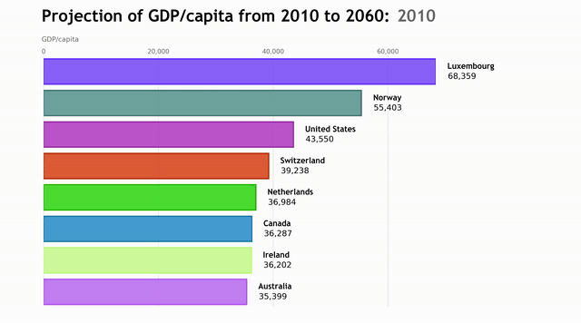

After reading [this article](https://towardsdatascience.com/bar-chart-race-in-python-with-matplotlib-8e687a5c8a41) from Pratap Vardhan with great interest, I 
wanted to build my own version of a Bar Chart Race that is smoother and a bit more beautiful. The biggest improvement is the interpolation (or augmentation) of 
the available data points in order to make the animation smoother.

Here is the Bar Chart Race we are going to build in this article:



For the purpose of this demonstration, we are going to use a GDP per capita forecast dataset provided by the OECD. You can find the original dataset [here](https://www.kaggle.com/auwsom/gdp-projections-to-2060-oecd-countries-and-world).
 
You can find the full code via GitHub at the end of the article!

## Importing Modules

We start by importing the modules. We are going to use `pandas` for data handling, `matplotlib` for the graphs, Numpy for matrix operations. The usage of 
`colorsys` and `re` will be explained later in the code.

```python
import pandas as pd
import numpy as np
import matplotlib
import matplotlib.pyplot as plt
import matplotlib.ticker as ticker
import matplotlib.animation as animation
import matplotlib.colors as mc
import colorsys
import re
from random import randint
```

## Data Preparation

We read in the CSV file and get rid of all variables except GDP per capita. We then delete data entries that resemble regions instead of single countries and 
delete all columns except `Country`, `Time` and `Value`.

```python
df = pd.read_csv("EO95_LTB_07012019070138125.csv")
df = df.loc[df['Variable'] == 'GDP per capita in USA 2005 PPPs']
df = df[((df.Country != 'OECD - Total') & 
         (df.Country != 'Non-OECDEconomies') &
         (df.Country != 'World') &
         (df.Country !='Euro area (15 countries)'))]
df = df[['Country', 'Time', 'Value']]
```

Now, we want to interpolate the data to make the animation smooth. In order to do that, we first pivot the data frame to wide format. I wrote a simple for-loop 
which adds the average value of two columns in between two existing values and assigns a numeric name, starting with the time value of the interpolated column. I 
add a ‘^’ to the name, so when I am displaying the time unit, I can easily get rid of everything behind this particular character.

When the last column of the data frame is reached, the code will run into an error because the df.iloc statement won’t be able to select a column (since it will 
be non-existent). Therefore, I use a try/except statement and indicate whenever an interpolation is done. The steps of interpolation can be adjusted by changing 
the `n` in `range(n)` in the for-loop.

Next, we pivot the table back to long format using the `melt` method.

```python
for p in range(3):
    i = 0
    while i < len(df.columns):
        try:
            a = np.array(df.iloc[:, i + 1])
            b = np.array(df.iloc[:, i + 2])
            c = (a + b) / 2
            df.insert(i+2, str(df.iloc[:, i + 1].name) + '^' +str(len(df.columns)), c)
        except:
            print(f"\n  Interpolation No. {p + 1} done...")
        i += 2
df = pd.melt(df, id_vars = 'Country', var_name = 'Time')
```

## Defining the Frames List

When creating animations with `matplotlib`, we always need a list of all frames, that will be passed to the core function that draws each frame. Here we create
this frames list by taking all unique values of the `time_unit` series and converting it to a list. I add the last value of the `time_unit` series (the last point 
in time) to the frames list five times in order to stop the animation for a few seconds at the end, before replay.

```python
frames_list = df["Time"].unique().tolist()
for i in range(10):
    frames_list.append(df['Time'].iloc[-1])
```

## Defining the Color Schema

The next block of code assigns the colors of the bar chart. First, I use a function that can transform any color to a lighter/darker shade. I have found the 
function in this Stackoverflow post. It requires the `colorsys` module we imported at the beginning.
 
Next, we put all names in a list and create as many random HEX colors as there are names. The reason why we use random colors is to add more flexibility into the 
code. We want it to be reusable, even if the number of elements changes. Lastly, we create three lists of these colors: normal colors, slightly transparent colors 
and darker colors.  

```python
def transform_color(color, amount = 0.5):

        try:
            c = mc.cnames[color]
            
        except:
            c = color
            c = colorsys.rgb_to_hls(*mc.to_rgb(c))
            
        return colorsys.hls_to_rgb(c[0], 1 - amount * (1 - c[1]), c[2])

all_names = df['Country'].unique().tolist()
random_hex_colors = []
for i in range(len(all_names)):
    random_hex_colors.append('#' + '%06X' % randint(0, 0xFFFFFF))

rgb_colors = [transform_color(i, 1) for i in random_hex_colors]
rgb_colors_opacity = [rgb_colors[x] + (0.825,) for x in range(len(rgb_colors))]
rgb_colors_dark = [transform_color(i, 1.12) for i in random_hex_colors]
```

Now we have arrived at the core function of this code!

We define a new data frame called `df_frame` which contains the top elements in this point in time.

We then draw a bar chart in this particular time frame with the top elements using the correct color from the `normal_colors` dictionary. In order to make the 
chart prettier, we draw a darker shade around each bar using the respective color from the dark_color dictionary.

The rest of the function is simply formatting the graph. We write the name and the value next to each bar. Then, we display the time unit of each frame at the top 
right position. Here we make use of the ‘^’ character we assigned earlier when we did the interpolation. Using a regular expression we can get rid of all 
characters after the ‘^’ and then display the respective time unit. Here we need the re module we imported at the beginning.

Next, we add the chart title and axis label, and we format the numbers on the x-axis and display them at the top of the chart. We get rid of the y-axis ticks and add grid lines to the chart.

Lastly, we limit the number of ticks to 4, get rid of the black frame around the chart and adjust the margin on each side.

```python
def draw_barchart(Time):

    df_frame = df[df['Time'].eq(Time)].sort_values(by = 'value', ascending = True).tail(num_of_elements)
    ax.clear()

    normal_colors = dict(zip(df['Country'].unique(), rgb_colors_opacity))
    dark_colors = dict(zip(df['Country'].unique(), rgb_colors_dark))
    
    ax.barh(df_frame['Country'], df_frame['value'], 
            color = [normal_colors[x] for x in df_frame['Country']],
            height = 0.8, 
            edgecolor = ([dark_colors[x] for x in 
                         df_frame['Country']]), linewidth = '6')

    dx = float(df_frame['value'].max()) / 200
    
    for i, (value, name) in 
    enumerate(zip(df_frame['value'], df_frame['Country'])):
                            
        ax.text(value + dx, i + (num_of_elements / 50), '    ' + 
                name, size = 36, weight = 'bold', ha = 'left', 
                va = 'center', fontdict = {'fontname': 'Trebuchet 
                MS'})
        ax.text(value + dx, i - (num_of_elements / 50), 
                f'{value:,.0f}', size = 36, ha = 'left', 
                va = 'center')

    time_unit_displayed = re.sub(r'\^(.*)', r'', str(Time))
    ax.text(1.0, 1.14, time_unit_displayed, 
            transform = ax.transAxes, color = '#666666',  
            size = 62, ha = 'right', 
            weight = 'bold', fontdict = {'fontname': 'Trebuchet 
            MS'})
    ax.text(-0.005, 1.06, 'GDP/capita', transform = ax.transAxes, 
            size = 30, color = '#666666')
    ax.text(-0.005, 1.14, 'Projection of GDP/capita from 2010 to  
            2060', transform = ax.transAxes, size = 62, 
            weight = 'bold', ha = 'left', fontdict = {'fontname': 
            'Trebuchet MS'})
           
    x.xaxis.set_major_formatter(ticker.StrMethodFormatter(
                               '{x:,.0f}'))
    ax.xaxis.set_ticks_position('top')
    ax.tick_params(axis = 'x', colors = '#666666',
                   labelsize = 28)
    ax.set_yticks([])
    ax.set_axisbelow(True)
    ax.margins(0, 0.01)
    ax.grid(which = 'major', axis = 'x', linestyle = '-')
    plt.locator_params(axis = 'x', nbins = 4)
    plt.box(False)
    plt.subplots_adjust(left = 0.075, right = 0.75, top = 0.825,
                        bottom = 0.05, wspace = 0.2, hspace = 0.2)
```

## Animation

The last step of every Matplotlib animation is to call the `FuncAnimation` method.

```python
animator = animation.FuncAnimation(fig, draw_barchart, 
                                   frames = frames_list)
animator.save("Racing Bar Chart.mp4", fps = 20, bitrate = 1800)
```

And that’s it. Feel free to play around with the code and adjust it to your needs. If you have any suggestion or question feel free to leave a comment below!

## Full Code on GitHub

Link: https://gist.github.com/gabriel-berardi/2598032da5ea0453cf3385c8ce73bafc

```python
import pandas as pd
import numpy as np
import matplotlib
import matplotlib.pyplot as plt
import matplotlib.ticker as ticker
import matplotlib.animation as animation
import matplotlib.colors as mc
import colorsys
from random import randint
import re

df = pd.read_csv("EO95_LTB_07012019070138125.csv")
df = df.loc[df['Variable'] == 'GDP per capita in USA 2005 PPPs']
df = df[((df.Country != 'OECD - Total') & ( df.Country != 'Non-OECD Economies') & (df.Country != 'World') & (df.Country != 'Euro area (15 countries)'))]
df = df[['Country', 'Time', 'Value']]

df = df.pivot(index = 'Country', columns = 'Time', values = 'Value')
df = df.reset_index()

for p in range(3):
    i = 0
    while i < len(df.columns):
        try:
            a = np.array(df.iloc[:, i + 1])
            b = np.array(df.iloc[:, i + 2])
            c = (a + b) / 2
            df.insert(i+2, str(df.iloc[:, i + 1].name) + '^' + str(len(df.columns)), c)
        except:
            print(f"\n  Interpolation No. {p + 1} done...")
        i += 2

df = pd.melt(df, id_vars = 'Country', var_name = 'Time')

frames_list = df["Time"].unique().tolist()
for i in range(10):
    frames_list.append(df['Time'].iloc[-1])

def transform_color(color, amount = 0.5):

    try:
        c = mc.cnames[color]
    except:
        c = color
        c = colorsys.rgb_to_hls(*mc.to_rgb(c))
    return colorsys.hls_to_rgb(c[0], 1 - amount * (1 - c[1]), c[2])

all_names = df['Country'].unique().tolist()
random_hex_colors = []
for i in range(len(all_names)):
    random_hex_colors.append('#' + '%06X' % randint(0, 0xFFFFFF))

rgb_colors = [transform_color(i, 1) for i in random_hex_colors]
rgb_colors_opacity = [rgb_colors[x] + (0.825,) for x in range(len(rgb_colors))]
rgb_colors_dark = [transform_color(i, 1.12) for i in random_hex_colors]

fig, ax = plt.subplots(figsize = (36, 20))

num_of_elements = 8

def draw_barchart(Time):

    df_frame = df[df['Time'].eq(Time)].sort_values(by = 'value', ascending = True).tail(num_of_elements)
    ax.clear()

    normal_colors = dict(zip(df['Country'].unique(), rgb_colors_opacity))
    dark_colors = dict(zip(df['Country'].unique(), rgb_colors_dark))
    
    ax.barh(df_frame['Country'], df_frame['value'], color = [normal_colors[x] for x in df_frame['Country']], height = 0.8,
            edgecolor =([dark_colors[x] for x in df_frame['Country']]), linewidth = '6')

    dx = float(df_frame['value'].max()) / 200

    for i, (value, name) in enumerate(zip(df_frame['value'], df_frame['Country'])):
        ax.text(value + dx, i + (num_of_elements / 50), '    ' + name,
        size = 36, weight = 'bold', ha = 'left', va = 'center', fontdict = {'fontname': 'Trebuchet MS'})
        ax.text(value + dx, i - (num_of_elements / 50), f'    {value:,.0f}', size = 36, ha = 'left', va = 'center')

    time_unit_displayed = re.sub(r'\^(.*)', r'', str(Time))
    ax.text(1.0, 1.14, time_unit_displayed, transform = ax.transAxes, color = '#666666',
            size = 62, ha = 'right', weight = 'bold', fontdict = {'fontname': 'Trebuchet MS'})
    ax.text(-0.005, 1.06, 'GDP/capita', transform = ax.transAxes, size = 30, color = '#666666')
    ax.text(-0.005, 1.14, 'Projection of GDP/capita from 2010 to 2060', transform = ax.transAxes,
            size = 62, weight = 'bold', ha = 'left', fontdict = {'fontname': 'Trebuchet MS'})

    ax.xaxis.set_major_formatter(ticker.StrMethodFormatter('{x:,.0f}'))
    ax.xaxis.set_ticks_position('top')
    ax.tick_params(axis = 'x', colors = '#666666', labelsize = 28)
    ax.set_yticks([])
    ax.set_axisbelow(True)
    ax.margins(0, 0.01)
    ax.grid(which = 'major', axis = 'x', linestyle = '-')

    plt.locator_params(axis = 'x', nbins = 4)
    plt.box(False)
    plt.subplots_adjust(left = 0.075, right = 0.75, top = 0.825, bottom = 0.05, wspace = 0.2, hspace = 0.2)

animator = animation.FuncAnimation(fig, draw_barchart, frames = frames_list)
animator.save("Racing Bar Chart.mp4", fps = 20, bitrate = 1800)
```

## Sources and Further Material

- https://www.kaggle.com/auwsom/gdp-projections-to-2060-oecd-countries-and-world
- https://matplotlib.org/3.1.1/api/animation_api.html 
