Linear and Logistic regression are among the most elementary algorithms for supervised learning. Supervised Learning describes the situation where we deal with labelled data, which means that we have labelled inputs and a target variable.

Despite the fact that both have the word "regression" in their name, only one of them is typically being used for solving regression problems!

Let's see how they work!

## Linear Regression

Linear regression is possibly the easiest, most intuitive way of making a quantitative prediction. The relationship between an independent and a dependent variable is assumed to be linear, meaning that the dependent variable can be predicted using a linear function of the independent variable. For example:

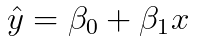

Where ŷ is the predicted value of the dependent variable, x is the independent variable, β0 is the y-intercept (aka bias-term) and β1 is a constant that determines the slope of the function.

In the above case, we only have one independent (aka explanatory) variable x. This case is called a "Simple Linear Regression".

If we have more than one independent explanatory variable, we talk about "Multiple Linear Regression", while as the case in which we try to predict more than one dependent variable is known as "Multivariate Regression".

For now, let's focus on the Simple Linear Regression and make things a bit clearer with an example.

Take a look at this scatter plot:

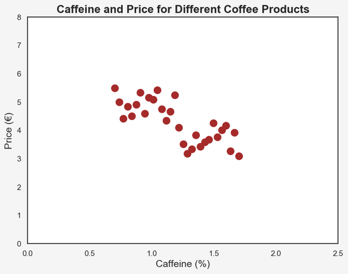

Here we see data for 30 different products of filter coffee. On the x-axis we have the percentage of Caffeine and on the y-axis the price per unit in Euro.

As human beings, it is quite simple for us to quickly spot an existing trend in a two-dimensional scatter plot. It seems that the higher the caffeine content is in a coffee product, the lower the price. This has something to do with the two common types of coffee: Arabica and Robusta. We'll get back to that later!

We can visualize this trend by adding a matching straight line to the scatter plot:

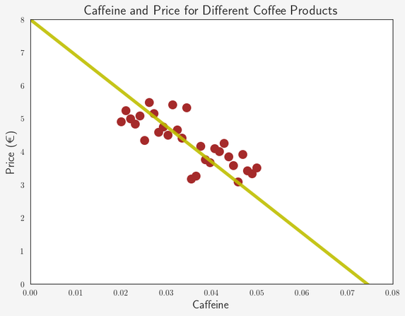

This yellow line seems about right. If we now know the percentage of caffeine for a new product, we can estimate its price by looking at the matching value on the yellow line or in the corresponding linear function.

But wait... How do we know this is really the best fitting line? Isn't there an infinite amount of lines we could plot that all more or less represent our data? How do we know which of the following lines is the best:

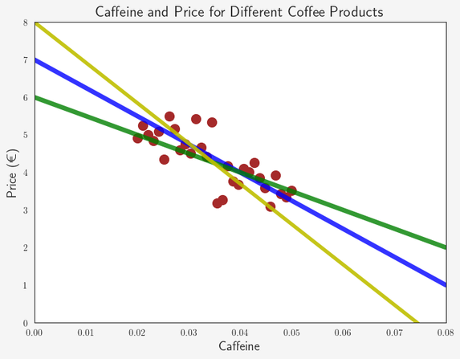

What we need is a certain criterion to measure the quality of these lines and their corresponding functions. Such a criterion is often called a "loss function" (aka cost function).

The most common criterion for regression problems is the "Root Mean Square Error (RMSE)", which represents the average mistake a model makes in its predictions, while big mistakes have a higher weight than small mistakes:

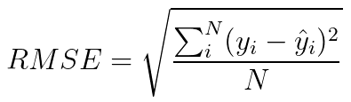

Naturally, we are looking for a linear regression function that minimizes the RMSE.

It is easier to do this minimization for the "Mean Squared Error MSE" instead, and it yields the same result!

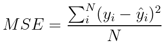

To find the best parameters for our regression function, we can use "Ordinary Least Squares", or alternatively an optimization algorithm called "Gradient Descent". You can read more about Gradient Descent [here](https://en.wikipedia.org/wiki/Gradient_descent).

I will not go into more details in this post. What's important is that we can find a linear regression function that minimizes the RMSE/MSE and therefore represents the best fitting line to our data.

In most simple terms, the goal of a linear regression is to find a function that is "closest" to as many data points as possible. In the 2-dimensional space, this function represents a line.

The GIF below visualizes this:


Let's now go back to our coffee example above. I will use the `statsmodels` package in Python to find the regression function for our dataset.

```python
import statsmodels.api as sm
df.Price = sm.add_constant(df.Price, prepend=False)
mod = sm.OLS(df.Caffeine, df.Price)
res = mod.fit()
print(res.summary())
```

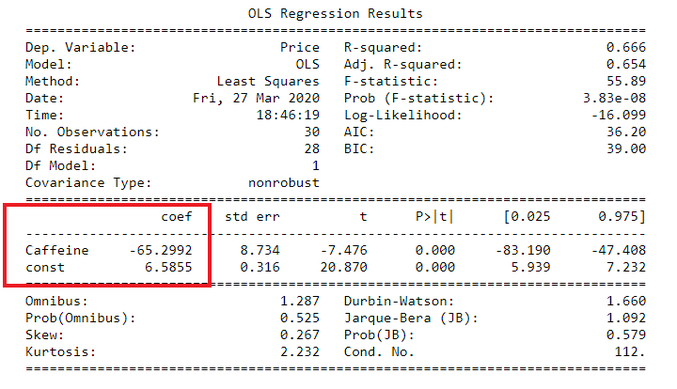

From the statsmodels summary we know that the y-intercept of the linear regression function is 6.5855 and the coefficient for our explanatory variable is -65.2992. Therefore, we can define our regression function for our example as:

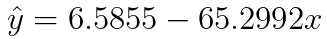

With this function, we can easily predict the price for a new product of coffee, of which we know the content of caffeine. For example, if the coffee has 1.5 % of caffeine, we predict the price to be 6.5855 - 65.2992 x 0.015 = 5.60 €.

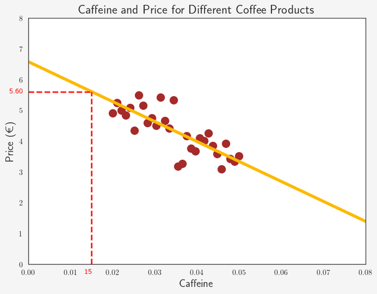

## Logistic Regression

Logistic Regression is a very powerful way to solve classification problems by assigning a certain probability of a class existing or event occurring.

In its basic form it uses a logistic function (a type of sigmoid function) to model a binary dependent variable, such as success/failure, yes/no, dog/cat etc.

A logistic function can be defined as:

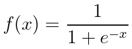

This function has an important characteristic: No matter what value you plug in for x, f(x) is always in the range from 0 to 1, which already gives us a hint that this function can be used to estimate probabilities.

Let's plot this:

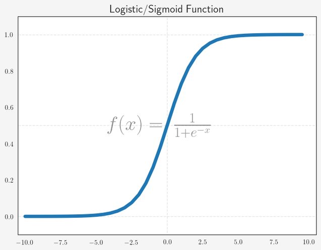

In the simplest case of having only one independent variable, the predicted probability of a logistic regression can be expressed as:

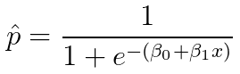

So all we need to do is to find the parameters β0/β1 that modify a logistic function which can model our data. As in the case of Linear Regression, we need a loss function to find these parameters. Such a loss function should be able to penalize the assignment of wrong probabilities by the model.
 
Let's say for one specific training data point where y = 1, two Logistic Regression models a and b predict 0.25 and 0.75 respectively. Both models predict a probability ≠ 1 and therefore we need to assign a loss to both of them. However, the loss for model a should be much larger than the loss for model b, because 
assuming a threshold of 0.5, model b would still have predicted the outcome to be 1 instead of 0.
 
Let's use the negative logarithm to assign a loss. Remember that we assume the true value y to be 1.

- Model a: -log(0.25) = - 0.60
- Model b: -log(0.75) = - 0.12

Let's plot a graph for all predicted probabilities:

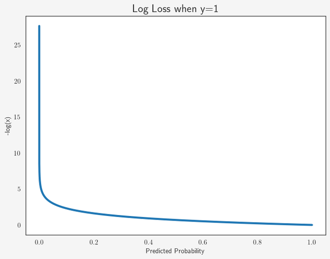

As we clearly see, the loss for p → 0 is extremely high, while higher predicted probabilities cause a much lower loss. If we had the situation of true y = 0, we 
would use -log(1-p) instead.

Long story short: we chose the "Log Loss" as our loss function to find the optimal parameters for our Logistic Regression function. You can read more about Log Loss 
[here](https://www.kaggle.com/dansbecker/what-is-log-loss). The optimal parameters can be found using Gradient Descent or another optimization algorithm.

Let's finally get back to our good old coffee example. As mentioned above, there are two main categories of coffee: Arabica and Robusta. Arabica generally 
contains less caffeine, yet is more expensive than Robusta!

Let's use Logistic Regression to train a model to determine the kind of coffee.

For our data we have the following features:

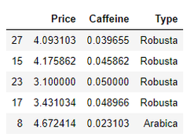

I will use `sklearn` to find the Logistic Regression function. I will only use the Price feature, in order to be able to plot the function.

```python
from sklearn.linear_model import LogisticRegression

X = df.loc[:, df.columns == 'Price']
y = list(df.loc[:, df.columns == 'Type'].Type)
logreg = LogisticRegression(random_state=42, solver="lbfgs")
logreg.fit(X, y)

print(f"Beta 0 is {round(logreg.intercept_[0], 4)}")
print(f"Beta 1 is {round(logreg.coef_[0][0], 4)}")
```

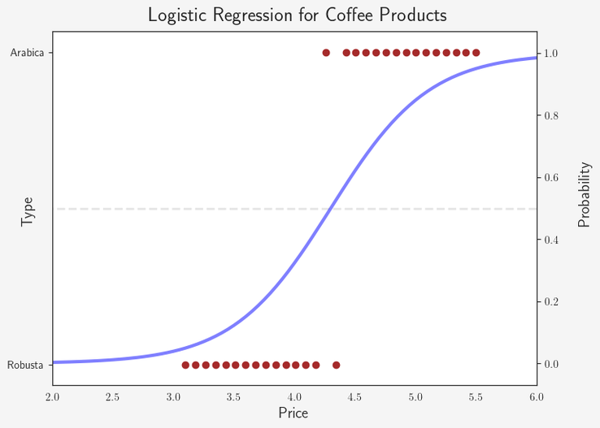

Note that `sklearn` uses a slightly different form of the logistic function mentioned above, meaning that we need to take the negative of these parameters to plug 
into our previous logistic function.

Therefore, the logistic function for our data is:

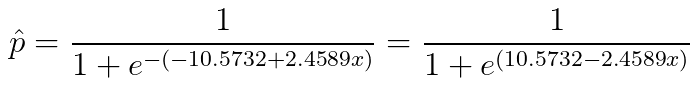

And if we plot this:

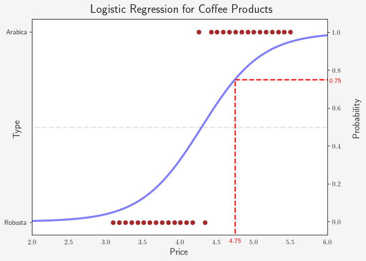

We want to determine the type for a new product of coffee, we simply plug the price, for example 4.75 €, into our function:
`1 / (1+e^(10.5731-2.4588*4.75)) = 75%`. Therefore, the model would predict that this coffee is an Arabica.

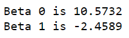

## Summary

That's it for this post. We have seen the basics of linear and logistic regression and how they can be used.

The table below summarizes the key differences between linear and logistic regression:

| Linear Regression | Logistic Regression |
|-------------------|----------------------|
| Models the relationship between one or more dependent variables with one or more independent variables | Predicts the probability of a binary outcome, using one or more dependent variables. |
| For regression problems | For classification problems |
| Uses a linear function | Uses a sigmoid function |
| Minimizes RMSE/MSE | Minimizes Log Loss |

## Sources and Further Material

- Geron, Aurélien - Hands-On Machine Learning (2017)
- Ng, Annalyn & Soo, Kenneth - Numsense! Data Science for the Layman (2017)
- https://en.wikipedia.org/wiki/Linear_regression 
- https://en.wikipedia.org/wiki/Logistic_regression 
