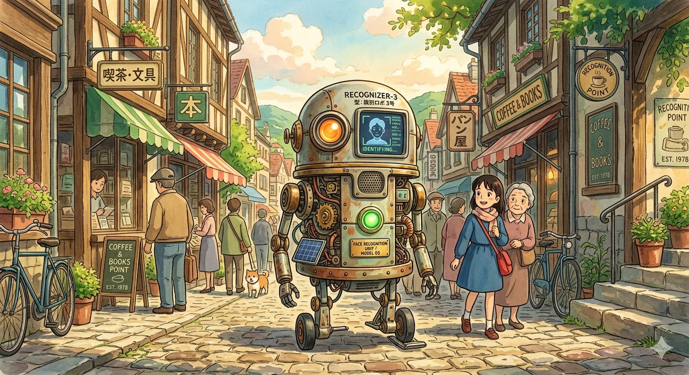

Have you ever seen some cool applications of computer vision tools, like this the one below?

Perhaps your phone's camera can autofocus on faces, or maybe you have uploaded a photo on a social media platform and it automatically recognized the person on the 
image?

These are facial recognition applications and they all rely on Machine Learning. In this post, we are going to use a very easy package called OpenCV to build our 
own facial recognition program!

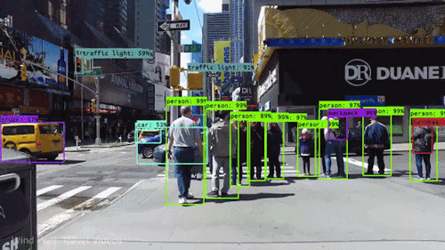

## What's OpenCV?

OpenCV (aka "Open Source Computer Vision Library") is an open source computer vision and machine learning software library. The library contains more than 2,500 
optimized algorithms for different computer vision tasks, such as recognizing faces and objects or removing red eyes from a photograph.

OpenCV has C++, Python, Java and MATLAB interfaces and supports Windows, Linux, Android and Mac OS. You can find out more about OpenCV [here](https://opencv.org/).

## Recognizing Faces From an Image

Let's say we have a photograph and want to write a program that can count the number of people in an image like this:

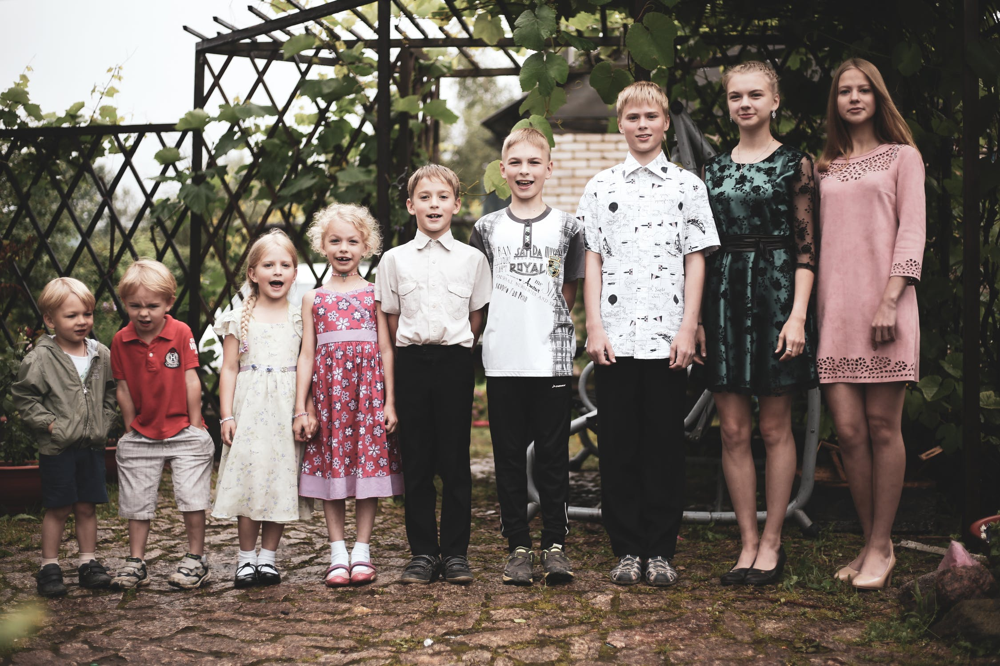

The first thing we need to do is importing the needed modules. Note that I will import matplotlib.pyplot only to display images in Jupyter Notebook:

```
import cv2 as cv
import matplotlib.pyplot as plt
```

Now we need to open our image and convert into gray-scale:

```python
img = cv.imread("people.jpeg")
gray_img = cv.cvtColor(img, cv2.COLOR_BGR2GRAY)
plt.imshow(gray_img, "gray")
plt.axis('off')
plt.show()
```
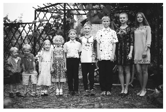

The reason why we remove the colours of the image has something to do with how computer vision algorithms work. Here is a brief explanation for this:

A colourless image can be represented as a matrix of values between 0 and 255 for each pixel in the image, in which case 0 represents black and 255 represents 
white and all values in between represent a certain shade of gray. However, a colourful image can only be represented as a three-dimensional matrix or three 
matrices stacked on top of each other, with each matrix containing values of 0 to 255 for the red, green and blue component of the colour of a pixel. Computer 
vision then uses these values as numerical inputs to algorithms to perform classification tasks.

Now, some computer vision tasks might certainly perform much better when using coloruful images. One might imagine that an algorithm can distinguish between an 
apple and a peach more easily when the images contain the colour-information. Other tasks, such as facial recognition, do not require colours and can perform much 
more efficiently when using gray-scale images.

If you want to read more on this topic, check out this article.

Moving on. Next, we need to find the pre-trained models from OpenCV. The easiest way to find the path to these files is to type in "haarcascades" into your OS 
search. You should find 17 XML files, looking like that:

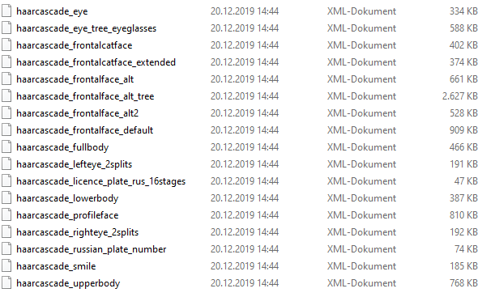

You can also find these on OpenCV's GitHub page.

From their name, you can tell the use case of these different models. For this example, I used the haarcascade_frontalface_alt_tree model.

Next, we pass this path as an argument to create a new instance of the cv.CascadeClassifier class.

Then we use the .detectMultiScale method and pass three arguments: our gray-scale image, scaleFactor and minNeighbors. scaleFactor parameter specifies how much the 
image size is reduced at each image scale.
The minNeighbors argument specifies how many neighbors each candidate rectangle should have to retain it. In other words, the minNeighbors parameter will affect 
the quality of detected faces. A high value results in fewer detections but with higher quality.

.detectMultiScale will return the position of all detected faces in our image. We save these coordinates to a variable called faces.

```python
classifier_path = "~/haarcascade_frontalface_alt_tree.xml"
classifier = cv.CascadeClassifier(classifier_path)
faces = classifier.detectMultiScale(gray_img, scaleFactor=1.05,     
                                    minNeighbors=3)
print(faces)
```
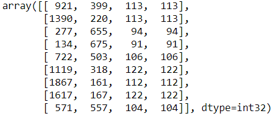

Lastly, all we have to do is draw some rectangles around the detected face on the image using the cv.rectangle method and output the image. For this, we use our 
original, colorful image and not the gray-scaled one, but that's really just for the sake of visualizing our results:

```python
c = img.copy()for face in faces:
    x, y, w, h = face
    cv.rectangle(c, (x, y), (x+w, y+h), (0, 255, 0), 10)

plt.figure(figsize=(16,16))
img = cv.cvtColor(c, cv.COLOR_BGR2RGB)
plt.annotate(f'Number of detected faces: {len(faces)}', 
             xy=(0.99, 0.02), xycoords='axes fraction',
             fontsize=20, color='green', bbox=dict(facecolor='black', 
             alpha=0.99), horizontalalignment='right',
             verticalalignment='bottom')
plt.axis('off')
plt.imshow(img)
```
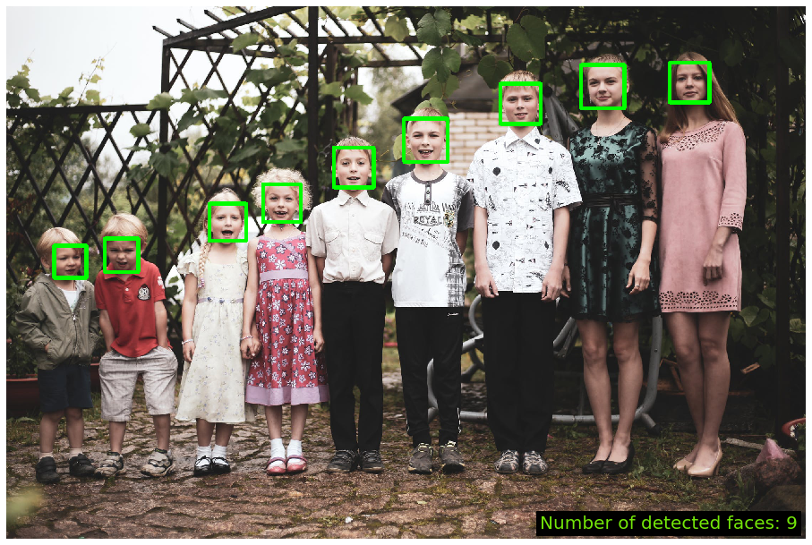

And there you have it. The pre-trained model from OpenCV has successfully detected and marked all faces on this photograph!

I ran the same code above for some other images. Here are some of the results:

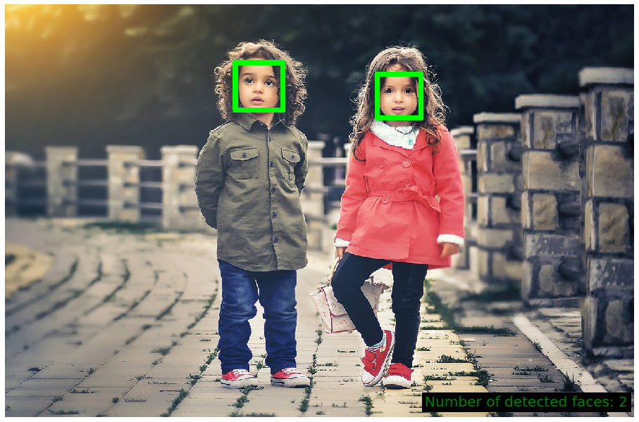
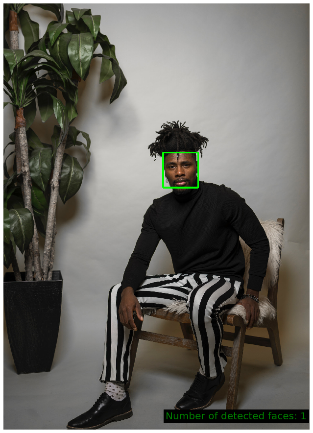
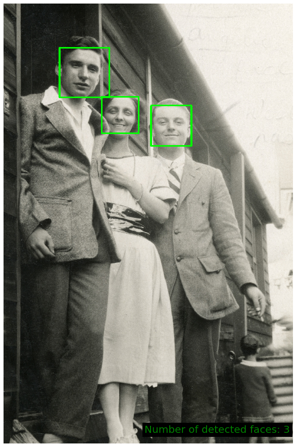
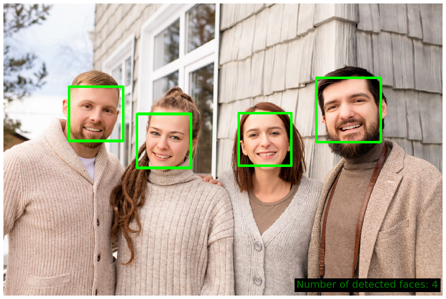

This looks pretty good. However, the model is far from being perfect! In many cases it fails to recognize all the faces on an image.

Have a look:

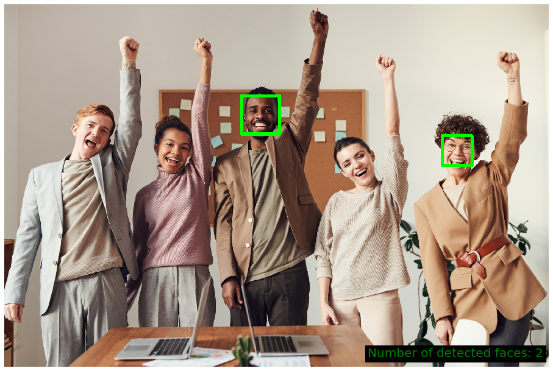
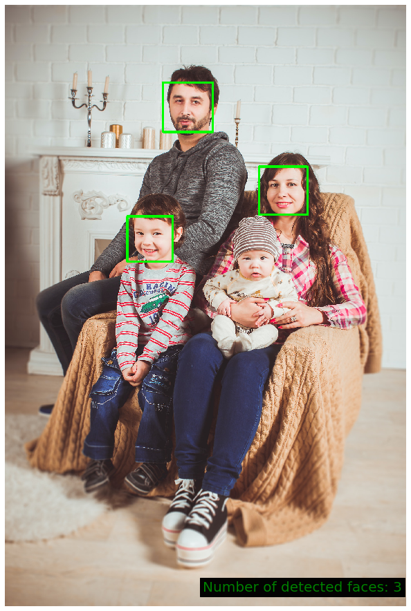
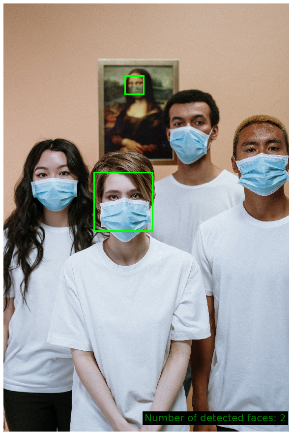
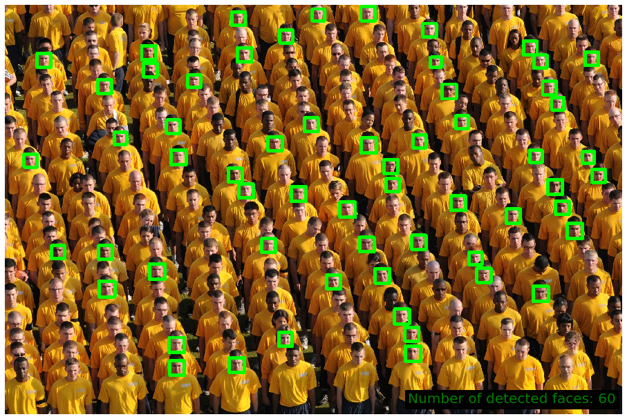

That's it for this post. In another post, I am going to demonstrate how OpenCV can be used for object recognition in videos. Stay tuned and thanks for reading!

## Full Code on GitHub

Link: https://gist.github.com/gabriel-berardi/3e4aeeebbe0b27eb030e8c84738ace9a

```python
import cv2 as cv
import matplotlib.pyplot as plt

img = cv.imread("people.jpeg")
gray_img = cv.cvtColor(img, cv2.COLOR_BGR2GRAY)
plt.imshow(gray_img, "gray")
plt.axis('off')
plt.show()

classifier_path = "~/haarcascade_frontalface_alt_tree.xml"
classifier = cv.CascadeClassifier(classifier_path)
faces = classifier.detectMultiScale(gray_img, scaleFactor=1.05, minNeighbors=3)
faces

c = img.copy()

for face in faces:
    x, y, w, h = face
    cv.rectangle(c, (x, y), (x+w, y+h), (0, 255, 0), 10)

plt.figure(figsize=(16,16))
img = cv.cvtColor(c, cv.COLOR_BGR2RGB)
plt.annotate(f'Number of detected faces: {len(faces)}', xy=(0.99, 0.02), xycoords='axes fraction',
             fontsize=20, color='green', bbox=dict(facecolor='black', alpha=0.99),
             horizontalalignment='right', verticalalignment='bottom')
plt.axis('off')
plt.imshow(img)
```

## Sources And Further Material

- https://docs.opencv.org/3.4/db/d28/tutorial_cascade_classifier.html 
- https://www.pexels.com/photo/children-taking-groupie-3556662/ 
- https://www.pexels.com/photo/group-of-people-smiling-3756513/ 
- https://www.pexels.com/photo/man-in-suit-jacket-and-woman-in-dress-grayscale-photo-3859002/ 
- https://www.pexels.com/photo/photo-of-man-sitting-on-wooden-chair-3617660/ 
- https://www.pexels.com/photo/people-girl-design-happy-35188/ 
- https://www.pexels.com/photo/people-men-women-crowd-34291/ 
- https://www.pexels.com/photo/people-wearing-face-mask-for-protection-3957986/ 
- https://www.pexels.com/photo/family-photo-1648358/ 
- https://www.pexels.com/photo/multi-cultural-people-3184419/ 
