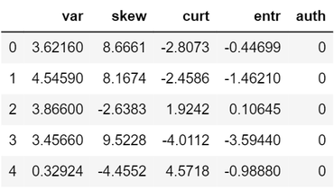
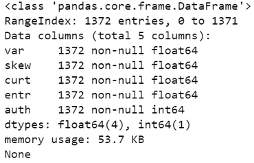
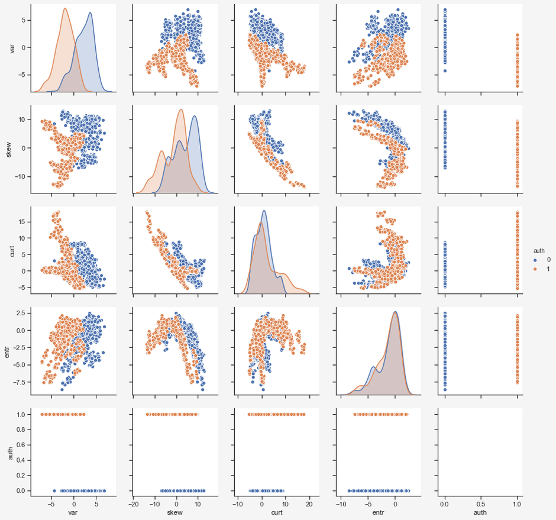
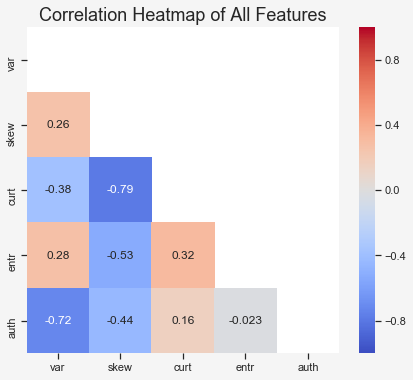
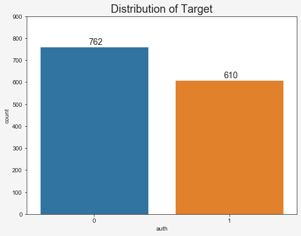
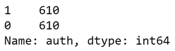
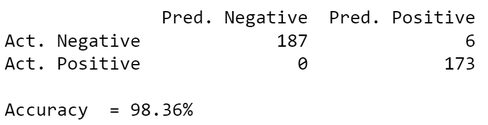
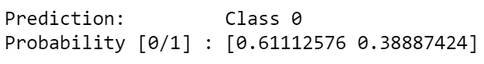

Counterfeit money is a real problem both for individuals and for businesses. Counterfeiters constantly find new ways and techniques to produce fake banknotes, that are essentially 
indistinguishable from real money. At least for the human eye!

Identifying forged banknotes is a typical example of a binary classification task in Machine Learning. If we have enough data of both real and forged banknotes, we can use this data to 
train a model that can classify new banknotes as either real or fake.

Therefore, in this post, we are going to explore how we can use a simple Logistic Regression to determine whether a banknote is real or forged!

## Data Exploration

I found a dataset on the UCI Machine Learning Repository that contains data of 1.372 real and forged banknotes. According to the UCI, the data was extracted from images of genuine and 
forged banknotes. The authors used Wavelet Transform to extract the first three features from these images. This is a quite complicated process, but broadly speaking, it means that they 
extracted information about the distribution of certain aspects of these images. If you are interested in the details, here's a link to a paper on this subject from the author of the 
dataset we are using. The fourth feature, the entropy, was obtained from the original images.
 
Let's spend one more minute on entropy. In general, entropy is a statistical measure of randomness. The entropy of an image can be understood as the amount of information within an 
image. 
The authors state that they have used 400x400 pixel images of the banknotes. In the paper co-written by the author of the original dataset, I found three images of a genuine banknote, a 
high-quality forgery and a low-quality forgery. I then used the [CakeImageAnalyzer](https://github.com/Jeanvit/CakeImageAnalyzer) tool by Jean Vitor to check the entropy of these three 
images.





The first image is the genuine banknote with an entropy  of 4.737. The second image is a high-quality forgery with an entropy of 4.373, while the last image is a low-quality forgery with 
an entropy of 4.189.

As we can see, there seems to be a connection between the entropy and the authenticity of a banknote. However, the entropy alone is not enough to reliably detect forged banknotes!

Now back to our task at hand. Our dataset contains these four input features:

- Variance of Wavelet Transformed image
- Skewness of Wavelet Transformed image
- Curtosis of Wavelet Transformed image
- Entropy of image

The target feature is simply 0 for real banknotes and 1 for forged banknotes.

Finally, let's start coding. First, we are going to need some modules.

```python
import pandas as pd
import numpy as np
import matplotlib.pyplot as plt
import seaborn as sns
from sklearn.model_selection import train_test_split
from sklearn.preprocessing import StandardScaler
from sklearn.linear_model import LogisticRegression
from sklearn.metrics import confusion_matrix
```

Next, we are going to read in the dataset, assign headers and check the first five rows to check if it worked.

```python
data = pd.read_csv('data_banknote_authentication.txt', header = None)
data.columns = ['var', 'skew', 'curt', 'entr', 'auth']
print(data.head()
```


Alright. Now let's start exploring the dataset. First, we should check the data types and if there are any missing values.

```python
print(data.info))
```


Perfect, no missing values and the datatypes of all the features are fine.

Now we can plot a pairplot to get an overview of the relationship between all features. I will also color the observations: blue for genuine banknotes and orange for forged banknotes.

```python
sns.pairplot(data, hue = 'auth')
plt.show()
```


From this pairplot we can make several interesting observations:

- The distribution for both the variance and the skewness seem to be quite different for the two target features, while the curtosis and entropy seem more alike.
- There are clear linear and non-linear trends in the input features.
- Some features seem to be correlated.
- Certain features seem to separate the genuine and forged banknotes quite well.

It is hard to see any correlation between the input features and the target feature, therefore I will plot a correlation heatmap.

```python
plt.figure(figsize=(7,6))
plt.title('Correlation Heatmap of All Features', size=18)
ax = sns.heatmap(data.corr(), cmap='coolwarm', vmin=-1, vmax=1,
                 center=0, mask=mask, annot=True)
plt.show()
```


Interesting. We can see a rather high correlation of -0.72 between the variance and the target feature and  some correlation of -0.44 between the skewness and the target feature.

It's important to keep in mind that the pd.DataFrame.corr() method uses Pearson correlation, which only measures the linear relationship between to variables. There might be other 
relationships in the data that cannot be observed so easily.

Last but not least, we should check if our data is balanced with regard to the target feature.

```python
plt.figure(figsize=(8,6))
plt.title('Distribution of Target', size=18)
sns.countplot(x=data['auth'])
target_count = data.auth.value_counts()
plt.annotate(s=target_count[0], xy=(-0.04,10+target_count[0]), 
             size=14)
plt.annotate(s=target_count[1], xy=(0.96,10+target_count[1]), 
             size=14)
plt.ylim(0,900)
plt.show()
```


The dataset is fairly balanced, but I think for this project, we should balance it perfectly. So let's start the data preprocessing by doing exactly that.

## Data Preprocessing

First, we are going to balance the dataset. The easiest way to do this is to randomly delete a number of instances of the overrepresented target feature. This is called random 
undersampling. In the opposite case, we could also create new synthethic data for the underrepresented target class. That would be called oversampling. You can read more on this topic
[here](https://en.wikipedia.org/wiki/Oversampling_and_undersampling_in_data_analysis). For now, let's randomly delete 152 observations of real banknotes.

There are various ways to achieve this. I decided to first shuffle the dataset, sort it to keep all genuine banknotes at the top, and then simply slice off the first 152 rows.  

```
nb_to_delete = target_count[0]-target_count[1]
data = data.sample(frac=1,random_state=42).sort_values(by='auth')
data = data[nb_to_delete:]print(data['auth'].value_counts())
```


Perfect. Now, we have an evenly balanced dataset.

Next, we need to split our data into a training set and a test set. I decided to use 70% of the data for training and 30 % for testing.

```python
X = data.loc[:, data.columns != 'auth']
y = data.loc[:, data.columns == 'auth']

X_train, X_test, y_train, y_test = train_test_split(X,
                                                    y,
                                                    test_size=0.3, 
                                                    random_state=42)
```

Finally, we should scale our input features. I am using standardization here, which means that for each datapoint in a given feature, we subtract the mean and divide it by the standard 
deviation. It is very important to only fit the scaler on the training set, not on the test set. Then, we use the obtained parameters on the test set. This is to prevent data leakage 
from the test set into the training set. It basically means that we need to treat the test data set as new, unseen data and prevent any information about the test set to be used for \
training our model. You can read more about this [here](https://sebastianraschka.com/faq/docs/scale-training-test.html).

```python
scaler = StandardScaler()
scaler.fit(X_train)
X_train = scaler.transform(X_train)
X_test = scaler.transform(X_test)
```

## Train and Test a Model

Now we only need to train our model. As mentioned before, we are going to use a Logistic Regression here. With Logistic Regression, we can not only classify new data, but we can also 
extract the probability that a new observation belongs to either class.

I am going to use the LogisticRegression class from sklearn and leave all parameters to default.

```python
clf = LogisticRegression(solver='lbfgs', random_state=42,
                         multi_class='auto')
clf.fit(X_train, y_train.values.ravel())
```

And ultimately, we can use the test set to make some predictions and compare them with the actual target class. To see how good the model performs, we can print out a confusion matrix 
and calculate the accuracy.

```python
y_pred = np.array(clf.predict(X_test))

conf_mat = pd.DataFrame(confusion_matrix(y_test, y_pred), 
                        columns=['Pred. Negative', 
                        'Pred. Positive'], 
                        index=['Act. Negative',
                        'Act. Positive'])

tn, fp, fn, tp = confusion_matrix(y_test, y_pred).ravel()
accuracy = round((tn+tp)/(tn+fp+fn+tp),4)

print(conf_mat)
print(f'\nAccuracy  = {round(100*accuracy,2)}%')
```


Neat! Our simple Logistic Regression model reached an accuracy of 98.36 %. And not only that: when the model predicted that a banknote was real (Pred. Negative), it was correct in 100 % 
of all cases.

One last thing we can do is to simulate the prediction of a single new banknote. All we need to do is to extract the features, scale them and feed them into our pretrained model. We can 
also inspect the probabilities that the banknote belongs to each target class.

```python
new_banknote = np.array([4.5, -8.1, 2.4, 1.4], ndmin=2)
new_banknote = scaler.transform(new_banknote)
print(f'Prediction:         Class {clf.predict(new_banknote)[0]}')
print(f'Probability [0/1] : {clf.predict_proba(new_banknote)[0]}')
```



Our model predicts that this banknote is real, but it estimates a probability of only 61%. In other words, the model is not very sure that this banknote is indeed genuine. The default 
threshold of the sklearn Logistic Regression to determine between class 0 (real) and class 1 (forged) is 50 %, but we could easily decrease this threshold to 30 or 40 %, in order to 
minimize the risk of wrongly accept a forged banknote as a real one.  A metric often used to determine the best threshold is the ROC or AUC respectively.

And that's it for this post. If you want, you can take a look at the full code and try to increase the accuracy of the model or try other methods like a Random Forest or an Artificial 
Neural Net. Thanks for reading!

## Full Code on Github
Link: https://gist.github.com/gabriel-berardi/ce716edb20c032714213ed6556abf27c

```python
# Importing required libraries

import pandas as pd
import numpy as np
import matplotlib.pyplot as plt
import seaborn as sns
from sklearn.model_selection import train_test_split
from sklearn.preprocessing import StandardScaler
from sklearn.linear_model import LogisticRegression
from sklearn.metrics import confusion_matrix

# Loading the dataset from https://archive.ics.uci.edu/ml/datasets/banknote+authentication

data = pd.read_csv('data_banknote_authentication.txt', header=None)
data.columns = ['var', 'skew', 'curt', 'entr', 'auth']
print(data.head())

# Show information about all features

print(data.info())

# Use pairplot to get an overview of the features

sns.pairplot(data, hue='auth')
plt.show()

# Display a correlation heatmap of all features

mask = np.zeros(data.corr().shape, dtype=bool)
mask[np.triu_indices(len(mask))] = True
plt.figure(figsize=(7,6))
plt.title('Correlation Heatmap of All Features', size=18)
ax = sns.heatmap(data.corr(), cmap='coolwarm', vmin=-1, vmax=1,
                 center=0, mask=mask, annot=True)
plt.show()

# Show the distribution of the target

plt.figure(figsize=(8,6))
plt.title('Distribution of Target', size=18)
sns.countplot(x=data['auth'])
target_count = data.auth.value_counts()
plt.annotate(s=target_count[0], xy=(-0.04,10+target_count[0]), size=14)
plt.annotate(s=target_count[1], xy=(0.96,10+target_count[1]), size=14)
plt.ylim(0,900)
plt.show()

# Balance the dataset with regard to the target feature

nb_to_delete = target_count[0]-target_count[1]
data = data.sample(frac=1, random_state=42).sort_values(by='auth')
data = data[nb_to_delete:]
print(data['auth'].value_counts())

# Split our data into a training and test data set

X = data.loc[:, data.columns != 'auth']
y = data.loc[:, data.columns == 'auth']
X_train, X_test, y_train, y_test = train_test_split(X, y, test_size=0.3, random_state=42)

# Scale the features. Note: only fit the scaler on training data to prevent data leakage

scaler = StandardScaler()
scaler.fit(X_train)
X_train = scaler.transform(X_train)
X_test = scaler.transform(X_test)

# Train a Logistic Regression model

clf = LogisticRegression(solver='lbfgs', random_state=42, multi_class='auto')
clf.fit(X_train, y_train.values.ravel())

# Make predictions on the test data

y_pred = np.array(clf.predict(X_test))

# Print a confusion matrix and calculate accuracy

conf_mat = pd.DataFrame(confusion_matrix(y_test, y_pred), 
                        columns=['Pred. Negative', 'Pred. Positive'], 
                        index=['Act. Negative', 'Act. Positive'])

tn, fp, fn, tp = confusion_matrix(y_test, y_pred).ravel()
accuracy = round((tn+tp)/(tn+fp+fn+tp),4)

print(conf_mat)
print(f'\nAccuracy  = {round(100*accuracy,2)}%')

# Simulate the prediction of a single new banknote

new_banknote = np.array([4.5, -8.1, 2.4, 1.4], ndmin=2)
new_banknote = scaler.transform(new_banknote)
print(f'Prediction:         Class {clf.predict(new_banknote)[0]}')
print(f'Probability [0/1] : {clf.predict_proba(new_banknote)[0]}')
```

## Sources and Further Materials

- https://archive.ics.uci.edu/ml/datasets/banknote+authentication 
- https://jeanvitor.com/image-entropy-value-visualization/ 
