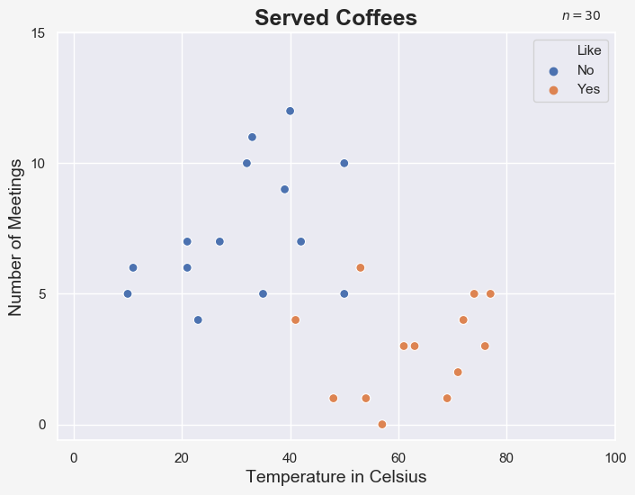
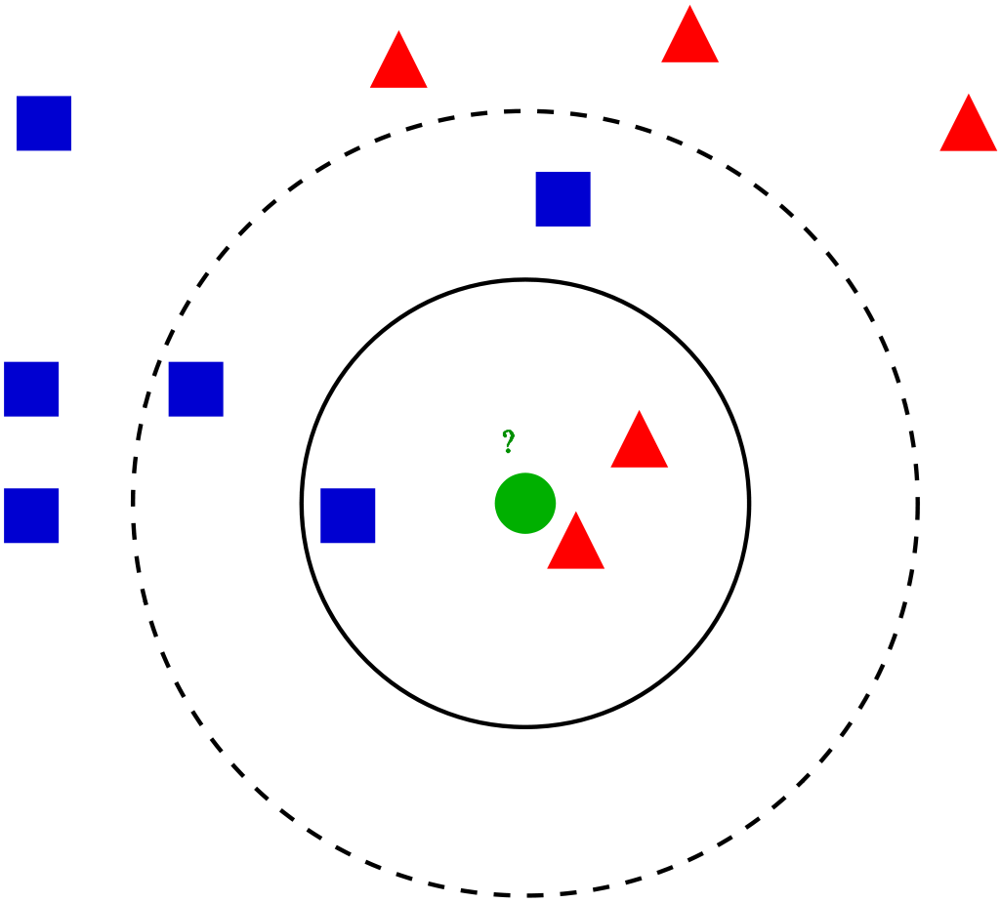
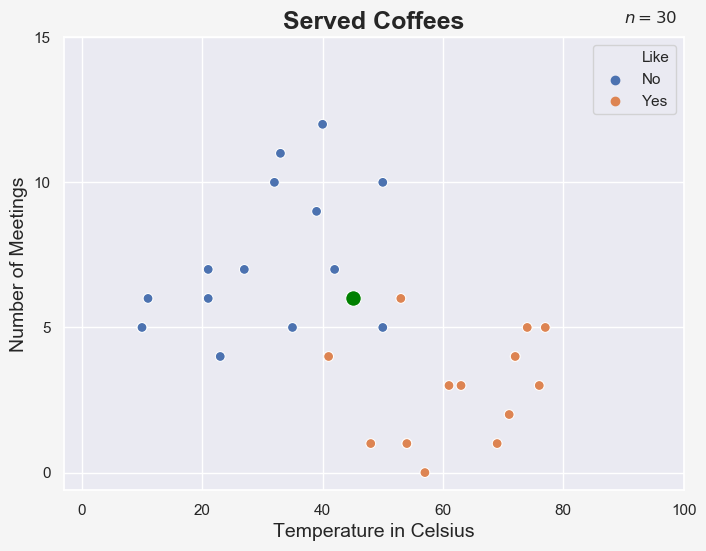
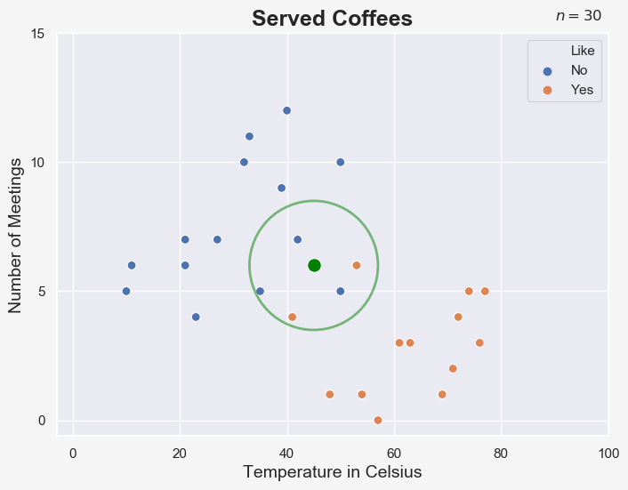

k-Nearest Neighbors, or k-NN as I am going to call it from now on, is one of the easiest algorithms to solve classification tasks. It can be used for regression 
problems as well, but I am going to focus on the more common use case of classification in this post.

In a nutshell, k-NN will assign a new data point to the class that the majority of its k neighbours in the training set belong to. Let's use another coffee-related 
example to see how that works.

Imagine an assistant to a CEO who buys a coffee for his boss every morning on the way to work. Sometimes, the CEO really likes the coffee and will praise the 
assistant. Other times, he dislikes the coffee and gives the assistant a hard time for the rest of the day. The assistant already knows that this has something to 
do with the temperature of the coffee and the number of meetings scheduled for that particular day.

The assistant decides to find a way to always predict whether his boss would like or dislike the cup of coffee, so that he could save the two bucks if the boss 
would dislike the coffee anyway. So, this assistant decides to measure the temperature of the coffee and note down the number of meetings as well as the reaction of 
the CEO. The assistant does that for 30 days and gathers the following data:

Looking at the data, we can easily spot that the assistant's boss likes his coffee hot and his days relaxed. But how can we predict whether he will or will not 
like a new coffee in the future?

Well, k-NN can do exactly that. Let's see how it works.

## How Does the k-NN Algorithm Work?

Here are the steps of the k-NN algorithm:

1. Safe the location and class of all data points in the training set
2. Set k, which is the number of neighbours to consider when determining the class of a new data point
3. Assign the new data point to the class that the majority of the k nearest data points belong to

A commonly used distance metric for continuous variables is the Euclidean distance, while Hamming distance may be used for discrete variables.
 
The question you should be asking yourself is how to decide what value to set for k. In general, we should consider the following three things when choosing a 
value for k:

- A small value of k means that noise will have a higher influence on the result, which might lead to overfitting
- A large value of k is computationally more expensive and might lead to underfitting
- To avoid incertitude, k should be an odd number

Looking at the following image will help you to understand these points better. First, it is clear that we wouldn't know what class we should assign the green 
data point to, if we chose an even number for k, such as 4 or 6. Second, we can see that one would obtain different results if k = 3 or k = 5.

Obviously, there is no one-fits all-answer how to choose k. Some suggest to chose k as the square root of your n data points (adjusted to be an odd number). 
Another option is to use cross-validation to select the optimal k value, using a validation set.

## k-NN in Action

Let's continue our imaginary example and apply k-NN on our coffee data.

Suppose we have a coffee with a temperature of 45 degree Celsius, brought into the office on a day with 6 meetings, represented by the green point on our scatter 
plot:

If the k-NN had been trained with k = 5, the algorithm would look at the class of the 5 closest data points. We can visualize this with a circle:

Since 3 out of 5 data points belong to the class "No", the k-NN algorithm would predict that the boss doesn't like this cup of coffee. It really is a simple as 
that!

k-NN is a so-called Lazy Learning method, which means that the majority of computation is deferred to the moment when we want to make a prediction. In other 
words, the k-NN algorithm simply saves the information of each data point in our training set and computes the distance to a new data point when used to make a 
new prediction.

## Limitations and Problems of k-NN

k-NN is as easy as it gets. As always, it has some limitations and problems:

- If we deal with unbalanced data, k-NN might easily overlook the underrepresented class.
- When we have a big dataset with many features, k-NN can be computationally extensive, because it needs to calculate the distance to each data point.
- The k-NN algorithm can be quite sensitive to outliers.

## Summary

The k-NN algorithm is a very common and easy to understand algorithm to solve classification problems. It used some distance metric to decide which class a new
data point belongs to, by comparing it to a number of k nearest neighbours.
 
k-NN works best for balanced data sets with relatively few features. Like many other algorithms, it also requires scaled data as training input.

## Sources and Further Materials

- Ng, Annalyn & Soo, Kenneth - Numsense! Data Science for the Layman (2017)
- https://en.wikipedia.org/wiki/K-nearest_neighbors_algorithm 
- https://www.youtube.com/watch?v=HVXime0nQeI
