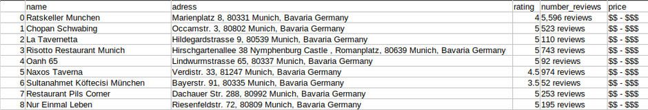
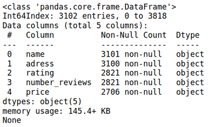
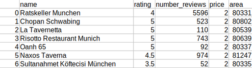
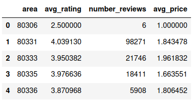
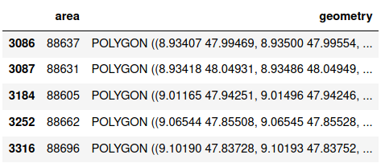
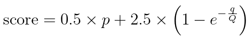
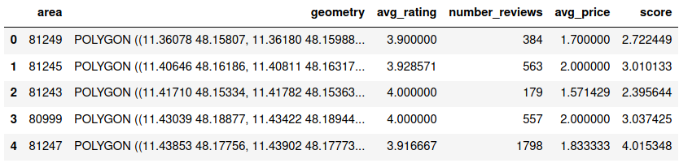
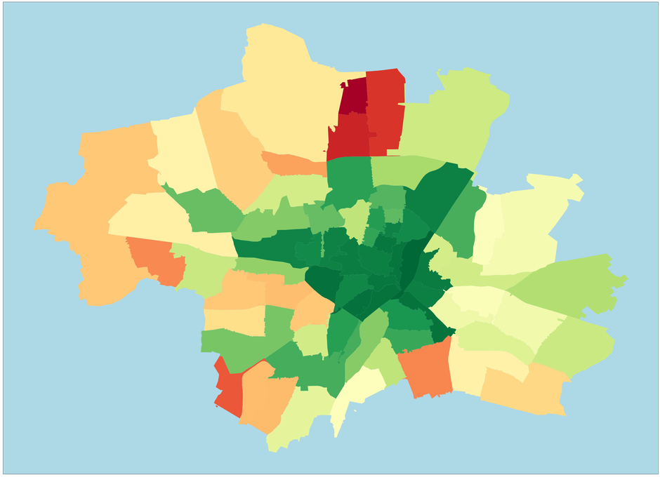
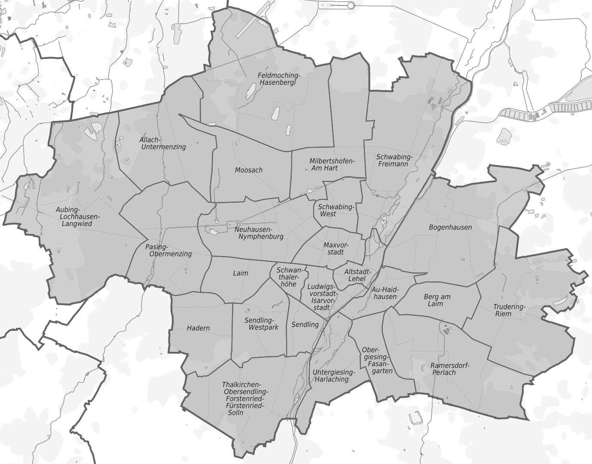
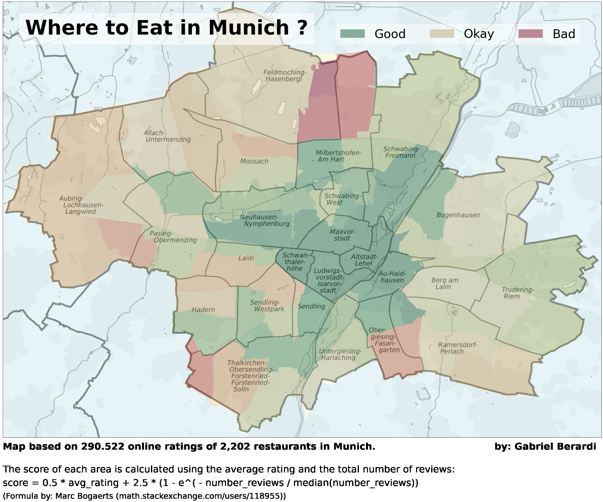

I recently moved to a new city - Munich! I live in a very calm area, but soon realized that the neighbourhood is not really the best when it comes to eating 
outside. So, I decided to try to analyse review data from the web to find out which area is most compelling for me and other foodies. I scraped online reviews, 
cleaned the data and then visualized it on a map, showing the average rating of restaurants in different areas in Munich.

## Getting the Data

In order to get data about all restaurants in Munich, I decided to scrape a popular website for restaurant reviews with Python and BeautifulSoup.

> Since web scraping is still a kind of legal grey area (check out [this](https://devm.io/law-net-culture/data-scraping-cases-165385) article), I prefer not to show which website I specifically scraped, but I will still explain my code. If you scrape a website, always make sure to follow the rules by the website host (which can be found in the robots.txt file) be courteous and add a short break in between your requests, in order not to overburden their servers.

As always, we need to import a bunch of libraries:

```python
import pandas as pd
import requests
import time
import matplotlib.pyplot as plt
import matplotlib.patches as mpatches
import matplotlib.patheffects as pe
import seaborn as sns
import geopandas as gpd
from bs4 import BeautifulSoup
from urllib.parse import urljoin
from random import randint
from math import e
```

Next, we specify the base URL, as well as the first URL extension of the website that we want to scrape. The main idea is that we are going to iterate over many 
pages containing information about the restaurants, where the base URL stays the same and only the URL extension changes, for example like this:

**Base URL:** www.google.com/ \
**URL extensions:** page-1, page-2, page-3...  

```python
base_url = 'WEBSITE'
first_page = 'EXTENSION.html'
```

Now we will collect all the URL extensions for each individual restaurant in a list. We do this by looking for all URLs referring to the respective CSS class and 
appending them to the list. Then we look for the "Next Page" button at the end of the website and concatenate the new URL extension to our base URL. When the last 
page has been reached, our script won't find the "Next Page" button and will end the loop. We then have a list containing all URL extensions for 3,821 restaurants 
in Munich. This step of the scraping took around 30 minutes.

```python
next_page = urljoin(base_url, first_page)
page_exts = []
i = 0

loop = True
while loop == True:
    i += 1
    print(f'Now scraping page number {i}...')
    time.sleep(randint(10,15))
    r = requests.get(next_page)
    soup = BeautifulSoup(r.text, "html.parser")
    
    for url in soup.find_all(class_="_15_ydu6b"):
        page_exts.append(url['href'])
        
        try:
            next_button = soup.find(class_='nav next rndBtn     
                         ui_button primary taLnk')['href']
            next_page = urljoin(base_url, next_button)
        
        except TypeError:
            print('Last Page Reached...')
            loop = False
```

As the final step of the web scraping process, we loop through this list of URL extensions, get the HTML code of that particular website and extract the following information about each restaurant:

- Name
- Location/Address
- Rating from 1 to 5
- Number of reviews
- Price range from $ to $$$$

Sometimes, the information we want might not be available in the form we expect. Therefore, we should use some try/except statements to avoid our code from 
breaking. Since I added a random time stop of 1, 2 or 3 seconds between all of my requests, this piece of code took almost 4 hours to finish! Therefore, I suggest 
using the pickle module to save results after every 1000th restaurant.

```python
rest_name = []
rest_loc = []
rest_rating = []
rest_norat = []
rest_price = []

for page_ext in page_exts:
    print(f'Now scraping restaurant number 
            {page_exts.index(page_ext)}...')
    time.sleep(randint(1,3))
    r = requests.get(urljoin(base_url, page_ext))
    soup = BeautifulSoup(r.text, "html.parser")
    
    try:
       rest_name.append(soup.find(class_='_3a1XQ88S').text)
    except AttributeError:
        rest_name.append(None) 
    try:
        rest_loc.append(soup.find(class_='_2saB_OSe').text)
    except AttributeError:
        rest_loc.append(None)
    try:
        rest_rating.append(soup.find(class_='r2Cf69qf').text)
    except AttributeError:
        rest_rating.append(None)
    try:
        rest_norat.append(soup.find(class_='_10Iv7dOs').text)
    except AttributeError:
        rest_norat.append(None)
    try:
        rest_price.append(soup.find(class_='_2mn01bsa').text)
    except AttributeError:
        rest_price.append(None)
```

The last thing I did is to generate a data frame with the data and save it to a CSV file.

```python
df = pd.DataFrame(data = list(zip(rest_name,
                                  rest_loc,
                                  rest_rating,
                                  rest_norat,
                                  rest_price)),
                  columns = ['name',
                             'address',
                             'rating',
                             'number_reviews',
                             'price'])
df.to_csv('restaurants.csv')
```

This is what the first few rows of the scraped, uncleaned dataset looked like:



## Cleaning the Data

Next, we should clean our dataset. Looking at the scraped data, we notice the following issues:

- Due to advertising on the website, some restaurants have been scraped several times. We need to remove these duplicate entries.
- There are null value entries in the dataset.
- In the "price" column, some entries are faulty, showing different information. Also, we should change the "$" characters into numerical values to display the price level of each restaurant.
- Since our goal is to visualize the quality of restaurants in different areas of Munich, we should format the "Address" column and only keep the area code. Also, some area codes in the data set do not really belong to Munich.
- Lastly, the "number_reviews" and the "rating" columns are of wrong data typed and should be converted to integers and floats respectively.

So, let's first load the dataset and drop the duplicate entries, keeping only the first instance.

```
df = pd.read_csv('munich restaurants.csv', 
                 index_col='Unnamed: 0')
df = df.drop_duplicates(keep='first')
```

Next, we check for null values and delete all rows containing null values.

```
print(df.info())
```



```python
df = df.dropna()
```

Then, we are going to delete all rows where the "Price Range" information is wrong, by only keeping entries that contain a "$" character.

```python
df = df[df['price'].str.contains('$', regex=False)] 
```

Proceeding, we take care of the "number_reviews" and the "rating" column.

```python
df.loc[:, 'number_reviews'] = df['number_reviews'].apply(lambda 
                              x: re.sub('[^0-9]','', x))
df['number_reviews'] = df['number_reviews'].astype(int)
df['rating'] = df['rating'].astype(float)
```

We replace the price range "$" column with an integer representing the price level of each restaurant.

```python
df['price'] = df['price'].replace('$', 1)
df['price'] = df['price'].replace('$$ - $$$',2)
df['price'] = df['price'].replace('$$$$', 3)
```

And now we format the address column to only keep the are codes. We do this with a function and a regex using the re package.

```python
import re

def get_area_code(string):
    try:
        return(re.search('\d{5}', string).group())
    except AttributeError:
        return(None)

df['area'] = df['address'].apply(lambda x: get_area_code(x))
df = df.drop('address', axis = 1)
df = df.dropna()
```

And finally, we delete all entries of restaurants that have an area code which not really belongs to Munich. Then, we save the cleaned dataset to another CSV 
file.

```python
not_munich = ['85356', '85640', '85540', '85551', '85646',  
              '85737','85757', '82194', '82041', '82194',  
              '82041', '82067','82031', '82049']
df = df[~df['area'].isin(not_munich)]

df.to_csv('munich restaurants cleaned.csv')
```

And that's it for the data preparation. We now have a clean data set of  2,202 restaurants, that looks like this:



Finally, we can visualize this data on a map.

## Visualizing the Data

The first we obviously need to do is to load the cleaned data set. Next, we are going to group it by the area code and taking the mean of the other variables. 
Because we are interested in the total number of reviews for each area code, we define this column specifically. Then we make sure that the area code is a string 
data type and rearrange the columns.

```python
df = pd.read_csv('munich restaurants cleaned.csv', index_col='Unnamed: 0')
df_by_area = df.groupby(by='area').mean()
df_by_area['number_reviews'] = df.groupby(by='area').sum()['number_reviews']
df_by_area = df_by_area.reset_index()
df_by_area['area'] = df_by_area['area'].astype(str)
df_by_area.columns = ['area', 'avg_rating',
                      'number_reviews', 'avg_price']
```

The data frame now looks like this:



Since we want to produce a map, we are going to need some geospatial information about each area code. After quite some research, I found a way to add a polygon 
to each area code. I downloaded the "plz-gebiete.shp" shapefile which contains geometrical polygons for most area codes in Germany from https://www.suche-
postleitzahl.org/downloads. I load this data into a pandas data frame, drop an unnecessary column and then filter out the data for area codes starting with "8" 
and rename the columns.

```python
area_shape_df = gpd.read_file('plz-gebiete.shp',
                              dtype={'plz': str})
area_shape_df = area_shape_df.drop('note', axis = 1)
area_shape_df = area_shape_df[area_shape_df['plz'].astype(str). 
                str.startswith('8')]
area_shape_df.columns = ['area', 'geometry']
```

The area_shape_df looks like this:



Next, we can simply join the two data frames on the "area" column and drop entries with missing values.

```python
final_df = pd.merge(left = area_shape_df,
                    right = df_by_area, on = 'area')
final_df = final_df.dropna()
```

Next, we need to think about our visualization a bit more. I would like to have a map of Munich that colors different areas according to the quality of the 
restaurants in that area. The question is how we want to define "quality" in this context.

You might think that we could just take the average rating of all restaurants in every area. This is an option, but there are several things to consider. For 
starters, some areas have many more restaurants and therefore also many more total reviews than other areas. This makes it difficult to compare two areas solely 
based on their average rating.

This is actually a problem that we would always encounter when comparing restaurants, products, hotels and so on based on online ratings.

Suppose you compare three movies A, B and C:

- A has 1.000 reviews with an average rating of 8 out of 10 points.
- B has 50 reviews with an average rating of 9 out of 10 points.
- C has 2 reviews with an average rating of 10 out of 10 points.

Most likely, you have come up with some heuristics to help you decide what movie to watch in such a setting. If you are like me, you would probably go with movie 
A, since an average rating of 8 with 1.000 reviews is more likely to be a good movie than movie B with only 50 reviews. Movie C would be out of question, because 
2 reviews is simply to few and the rating could even be fake.

The importance we assign to the average rating and the number of reviews respectively will always be subjective, but we should at least try to come up with a way 
to incorporate both of these aspects into our measurement of "quality" for the restaurants in Munich.

I did not find many different approaches to this problem, but the one that I personally liked best is from [this post](https://math.stackexchange.com/a/942965). The author Marc Bogaerts defines an 
algorithm that takes in both the average rating and the number of reviews and outputs a score. I have adapted the algorithm to our current setting and it looks 
like this:



Where p is the average rating, q is the number of reviews and Q is the median of the number of reviews. Note that in the original algorithm, Marc Bogaerts proposed to set Q equal to a number that we would consider "moderate". In my opinion the median is a good approach to a "moderate" value.

- Let's take a look at the first half of the formulae: 0.5 * p. This tells us that 50% of the final score is determined by the average rating. 
- Now let's look at the second half: 2.5 * (1 - e ^(-q/Q)).The expression e ^(-q/Q) can take values between 0 and 1. Suppose the number of ratings is equal to 1 
and the median number of reviews is 1000. e^(-1/1000) is equal to 0.999, which lead the term inside brackets to be slightly over 0 and the second half of the 
expression to be almost 0 as well. Hence, such a low number of ratings will punish the score, by basically taking only half of the average rating. For more 
information on the formulae, I suggest reading the linked post.

When implemented in Python, this would look like this:

```python
p = final_df['avg_rating']
q = final_df['number_reviews']Q = final_df['number_reviews'].median()

final_df['Score'] = 0.5 * p + 2.5 * (1 - e**(-q / Q))
```

The final data frame we will use as the basis for our visualization looks like this:



Now let's move on to the actual visualization.

With the geometrical polygons, we are able to plot our data as a map, like this:

```python
plt.rcParams['figure.figsize'] = [48, 32]
fig, ax = plt.subplots()
final_df.plot(ax = ax, zorder = 0, column = 'score',
              categorical = False, cmap='RdYlGn')
ax.set(facecolor = 'lightblue', aspect = 1.4, xticks = [], yticks = [])
plt.show()
```



In order to make the map clearer, I simply used this map as the background for the plot:



While our data contains data for all area codes, this map shows the different area names of Munich. Note that one area name can contain different area codes and 
one area code can lie within several area names.

The rest of the code is simply aesthetics and annotations:

```python
plt.rcParams['figure.figsize'] = [48, 32]
img = plt.imread('munich map.png')

fig, ax = plt.subplots()

final_df.plot(ax = ax, zorder = 0, column = 'score',
              categorical = False, cmap='RdYlGn')
ax.imshow(img, zorder = 1,
          extent = [11.36, 11.725, 48.06, 48.250], alpha = 0.7)

red_patch = mpatches.Patch(color='#bb8995', label = 'Bad')
yellow_patch = mpatches.Patch(color='#d6d0b9', label = 'Okay')
green_patch = mpatches.Patch(color='#89ab9a', label = 'Good')
plt.legend(handles=[green_patch, yellow_patch, red_patch],
           facecolor = 'white', edgecolor='lightgrey',
           fancybox=True, framealpha=0.5, loc = 'right',               
           bbox_to_anchor=(0.975, 0.925), ncol = 3, 
           fontsize = 48)

ax.text(0.0375, 0.925, 'Where to Eat in Munich ?', fontsize = 80, 
        weight = 'bold', transform = ax.transAxes,
        bbox = dict(facecolor = 'white', edgecolor = 'lightgrey',
        alpha = 0.6, pad = 25))
plt.annotate('Map based on 290.522 online ratings of 2,202 restaurants in Munich.', (0, 0), (0, -20), 
              fontsize = 38, weight = 'bold', 
              xycoords = 'axes fraction', 
              textcoords='offset points', va = 'top')
plt.annotate('by: Gabriel Berardi', (0,0), (1960, -20), 
              fontsize = 38, weight = 'bold', 
              xycoords = 'axes fraction', 
              textcoords = 'offset points', va = 'top')
plt.annotate('\nThe score of each area is calculated using the 
              average rating and the total number of reviews:', 
              (0, 0),(0, -70), fontsize = 38, xycoords = 'axes 
              fraction',textcoords = 'offset points', va = 'top')
plt.annotate('score = 0.5 * avg_rating + 2.5 * (1 - e^( - 
              number_reviews / median(number_reviews))',(0,0), 
              (0, -165), fontsize = 38, xycoords = 'axes 
              fraction', textcoords = 'offset points', 
              va = 'top')
plt.annotate('(Formula by: Marc Bogaerts (math.stackexchange.com/ 
               users/118955))', (0, 0), (0, -220), fontsize = 32,
               xycoords = 'axes fraction',
               textcoords = 'offset points', va = 'top')

ax.set(facecolor = 'lightblue', aspect = 1.4, xticks = [], 
       yticks = [])
plt.show()
```



And that's the final visualization. As you can see, the polygons do not match up perfectly with the underlying map on the borders, but this is fine for our little 
project here.

The central areas of Munich tend to be the place to go for a dine-out, while the outskirts should be avoided. This result is dependent on the weights we assigned 
to the average rating and the number of reviews in these areas. As one would expect, there are far fewer restaurants in the outer areas of Munich.

That's it for this little web scraping and data visualization project. Let me know what you would have done differently or how my approach could be enhanced! 
Thanks!

## Full Code on Github

Link: https://gist.github.com/gabriel-berardi/743fbcaf874badce9469e1ad41591bcb

```python
# Import required ibraries

import pandas as pd
import requests
import time
import re
import matplotlib.pyplot as plt
import matplotlib.patches as mpatches
import matplotlib.patheffects as pe
import seaborn as sns
import geopandas as gpd
from math import e
from bs4 import BeautifulSoup
from urllib.parse import urljoin
from random import randint

# Set the base url and the first page to scrape

base_url = 'URL'
first_page = 'Extension'

# This code block retrieves the url extensions for all restaurants

next_page = urljoin(base_url, first_page)
page_exts = []
i = 0

loop = True
while loop == True:
    i += 1
    print(f'Now scraping page number {i}...')
    time.sleep(randint(10,15))
    r = requests.get(next_page)
    soup = BeautifulSoup(r.text, "html.parser")

    for url in soup.find_all(class_ = "_15_ydu6b"):
        page_exts.append(url['href'])
        
    try:
        next_button = soup.find(class_ = 'nav next rndBtn ui_button primary taLnk')['href']
        next_page = urljoin(base_url, next_button)
    except TypeError:
        print('Last Page Reached...')
        loop = False

# This code block extracts the name, location, rating, number of reviews and price range
# from all the restaurants

rest_name = []
rest_loc = []
rest_rating = []
rest_norat = []
rest_price = []

for page_ext in page_exts:
    print(f'Now scraping restaurant number {page_exts.index(page_ext)}...')
    time.sleep(randint(1,3))
    r = requests.get(urljoin(base_url, page_ext))
    soup = BeautifulSoup(r.text, "html.parser")
    try:
        rest_name.append(soup.find(class_ = '_3a1XQ88S').text)
    except AttributeError:
        rest_name.append(None)
    try:
        rest_loc.append(soup.find(class_ = '_2saB_OSe').text)
    except AttributeError:
        rest_loc.append(None)
    try:
        rest_rating.append(soup.find(class_ = 'r2Cf69qf').text)
    except AttributeError:
        rest_rating.append(None)
    try:
        rest_norat.append(soup.find(class_ = '_10Iv7dOs').text)
    except AttributeError:
        rest_norat.append(None)
    try:
        rest_price.append(soup.find(class_ = '_2mn01bsa').text)
    except AttributeError:
        rest_price.append(None)

# Create the dataframe from the scraped data and save it to a csv file

df = pd.DataFrame(data = list(zip(rest_name,
                                  rest_loc,
                                  rest_rating,
                                  rest_norat,
                                  rest_price)),
                  columns = ['name',
                             'address',
                             'rating',
                             'number_reviews',
                             'price'])
df.to_csv('restaurants.csv')

# Reading in the raw scraped data

df = pd.read_csv('munich restaurants.csv', index_col = 'Unnamed: 0')

# Delete all duplicate rows and only keep the first entry

df = df.drop_duplicates(keep = 'first')

# Checking for null values

print(df.info())

# Drop all rows contain null values

df = df.dropna()

# Delete all rows where the 'Price Range' information is wrong

df = df[df['price'].str.contains('$', regex = False)]

# Format the 'No. of Ratings' column

df.loc[:, 'number_reviews'] = df['number_reviews'].apply(lambda x: re.sub('[^0-9]','', x))
df['number_reviews'] = df['number_reviews'].astype(int)

# Format the 'Rating' column

df['rating'] = df['rating'].astype(float)

# Format the 'Price Range' column

df['price'] = df['price'].replace('$', 1)
df['price'] = df['price'].replace('$$ - $$$',2)
df['price'] = df['price'].replace('$$$$', 3)

# Format the 'Address column' to only keep the area code

def get_area_code(string):
    try:
        return(re.search('\d{5}', string).group())
    except AttributeError:
        return(None)
    
df['area'] = df['address'].apply(lambda x: get_area_code(x))
df = df.drop('address', axis = 1)
df = df.dropna()

# Drop all areas that don't belong to Munich

not_munich = ['85356', '85640', '85540', '85551', '85646', '85737',
              '85757', '82194', '82041', '82194', '82041', '82067', '82031', '82049']
df = df[~df['area'].isin(not_munich)]

# Saving cleaned dataset to a csv file

df.to_csv('munich restaurants cleaned.csv')

# Load the cleaned dataset

df = pd.read_csv('munich restaurants cleaned.csv', index_col='Unnamed: 0')

# Group the dataframe by area code

df_by_area = df.groupby(by = 'area').mean()
df_by_area['number_reviews'] = df.groupby(by = 'area').sum()['number_reviews']
df_by_area = df_by_area.reset_index()
df_by_area['area'] = df_by_area['area'].astype(str)
df_by_area.columns = ['area', 'avg_rating', 'number_reviews', 'avg_price']

# Create a dataframe with geometrical data for all area codes
# Shapefile from https://www.suche-postleitzahl.org/downloads

area_shape_df = gpd.read_file('plz-gebiete.shp', dtype = {'plz': str})
area_shape_df = area_shape_df.drop('note', axis = 1)
area_shape_df = area_shape_df[area_shape_df['plz'].astype(str).str.startswith('8')]
area_shape_df.columns = ['area', 'geometry']

# Merge the dataframes and drop missing values

final_df = pd.merge(left = area_shape_df, right = df_by_area, on = 'area')
final_df = final_df.dropna()

# Apply a function to calculate the score of each area 
# https://math.stackexchange.com/questions/942738

p = final_df['avg_rating']
q = final_df['number_reviews']
Q = final_df['number_reviews'].median()

final_df['score'] = 0.5 * p + 2.5 * (1 - e**(-q / Q))

# Create plot to show the map
# Map from https://upload.wikimedia.org/wikipedia/commons/2/2d/Karte_der_Stadtbezirke_in_M%C3%BCnchen.png

plt.rcParams['figure.figsize'] = [48, 32]
img = plt.imread('munich map.png')

fig, ax = plt.subplots()

final_df.plot(ax = ax, zorder = 0, column = 'score', categorical = False, cmap='RdYlGn')
ax.imshow(img, zorder = 1, extent = [11.36, 11.725, 48.06, 48.250], alpha = 0.7)

red_patch = mpatches.Patch(color='#bb8995', label = 'Bad')
yellow_patch = mpatches.Patch(color='#d6d0b9', label = 'Okay')
green_patch = mpatches.Patch(color='#89ab9a', label = 'Good')
plt.legend(handles=[green_patch, yellow_patch, red_patch], facecolor = 'white', edgecolor='lightgrey',
           fancybox=True, framealpha=0.5, loc = 'right', bbox_to_anchor=(0.975, 0.925), ncol = 3, fontsize = 48)

ax.text(0.0375, 0.925, 'Where to Eat in Munich ?', fontsize = 80, weight = 'bold',
        transform = ax.transAxes, bbox = dict(facecolor = 'white', edgecolor = 'lightgrey', alpha = 0.6, pad = 25))
plt.annotate('Map based on 290.522 online ratings of 2,202 restaurants in Munich.',
             (0, 0), (0, -20), fontsize = 38, weight = 'bold', xycoords = 'axes fraction',
             textcoords='offset points', va = 'top')
plt.annotate('by: Gabriel Berardi', (0,0), (1960, -20), fontsize = 38, weight = 'bold', 
             xycoords = 'axes fraction', textcoords = 'offset points', va = 'top')
plt.annotate('\nThe score of each area is calculated using the average rating and the total number of reviews:',
             (0, 0), (0, -70), fontsize = 38, xycoords = 'axes fraction', textcoords = 'offset points', va = 'top')
plt.annotate('score = 0.5 * avg_rating + 2.5 * (1 - e^( - number_reviews / median(number_reviews))',
             (0,0), (0, -165), fontsize = 38, xycoords = 'axes fraction', textcoords = 'offset points', va = 'top')
plt.annotate('(Formula by: Marc Bogaerts (math.stackexchange.com/users/118955))', (0, 0), (0, -220),
             fontsize = 32, xycoords = 'axes fraction', textcoords = 'offset points', va = 'top')

ax.set(facecolor = 'lightblue', aspect = 1.4, xticks = [], yticks = [])
plt.show()
```

## Sources and Further Material

- https://math.stackexchange.com/questions/942738/ 
- https://upload.wikimedia.org/wikipedia/commons/2/2d/Karte_der_Stadtbezirke_in_M%C3%BCnchen.png 
