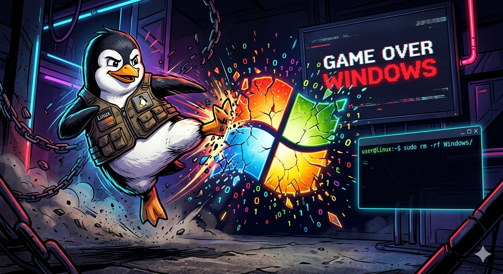

---

In 2020, I made a deliberate choice to switch to Linux and free and open-source software (FOSS). It wasn’t about saving money. It was about aligning my tools with my values: transparency, community, and the freedom to control my own digital life.

But life, as it often does, had other plans.

---

## The Convenience Trap

When I applied for a new job in 2024, the interview process required me to use PowerBI for a case study. At the time, I didn’t know about the alternatives—like running Windows in a virtual machine, using Wine, or even WinBoat. I just knew I needed to get the job.

So, I did what felt necessary: I bought a new laptop with Windows 11.

I told myself it was temporary. *"I’ll wipe Windows and install Linux as soon as I can,"* I thought. But I didn’t.

The truth? Life was busy. And the Microsoft ecosystem—PowerBI, Word, Excel, Teams, and especially OneDrive—offered something seductive: *convenience*. Everything worked together seamlessly, as long as I stayed within Microsoft’s golden cage.

It was like a drug. No decisions to make. No responsibility to choose. Just plug in and go.

But convenience has a cost: I essentially gave up all control.

---

## The Breaking Point

Fast forward two years. Two things happened almost simultaneously:

1. My Windows laptop broke. Not a slow decline—just a sudden, frustrating failure.
2. I’d had enough. The culture of monopolistic big tech companies, privacy concerns, and the constant nudge to stay locked into one ecosystem was wearing me down.

I realized I’d traded my values for convenience. And I wasn’t happy about it.

So, I made a decision: I bought a new PC, ditched Windows, and returned to Linux and FOSS for good.

---

## My FOSS Toolkit: What Replaced What

Here’s what I swapped out - and what I’m using now:

   Old Tool          | New Tool       |
 |-------------------|----------------|
 | Windows 11        | Linux Mint     |
 | Microsoft Office  | LibreOffice    |
 | Microsoft Outlook | Thunderbird    |
 | OneDrive          | Peergos        |

I’ve also been using a [long list of other FOSS tools](https://gabriel-berardi.com/ressources/#-recommended-foss) for everything from graphic design to password management.

---

## The Philosophy of FOSS: Freedom, Not Free Beer

FOSS isn’t just about saving money. It’s about freedom. The freedom to use, modify, and share software without restrictions. No one owns these tools. No one can take them away.

But here’s the catch: "Free as in freedom" doesn’t mean "free as in free beer." Open-source projects rely on contributions—whether that’s code, documentation, donations, or simply spreading the word.

**If you use FOSS, I encourage you to give back in whatever way you can.**

---

## How I Contribute - and How You Can Too

Personally, I’ve committed to donating at least what I used to pay for my Microsoft 365 subscription to FOSS projects. Sometimes, I give more.

But money isn’t the only way to contribute. You can:
- Report bugs or suggest improvements.
- Help others in forums or communities.
- Write documentation or translate software.
- Open pull requests if you’re a developer.

Every contribution, no matter how small, makes a difference.

---

## What’s Next?

Am I 100% FOSS now? Almost. There are still a few proprietary tools I rely on for specific tasks, but I’m actively working to replace them.

The bigger question is: What’s your relationship with software? Have you ever felt trapped by proprietary tools? Have you made the switch to FOSS—or are you thinking about it?

I’d love to hear your story. Let’s keep the conversation going.

--- keep the conversation going.

---eep the